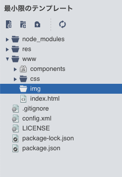
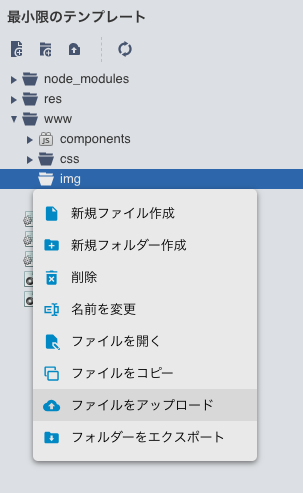

name: inverse
layout: true
class: center, middle, inverse
---
# MonacaEasyStartApp
富士通クラウドテクノロジーズ株式会社

.right[]

.footnote[
20190804
]

---
layout: true
class: center, middle, inverse_sub
---
## はじめに

---
layout: false
### 概要

自己紹介アプリを使ってみんなに自己紹介をしよう！


---
### 今日体験する内容
#### 「自己紹介アプリ」を作りましょう
hogehoge

1. 下書き
1. Monacaの準備
1. Monacaの練習
1. コーディング①（パーツの書き方）
1. コーディング②（アレンジの仕方）
1. TRY：レベルアップコーディング
  <!-- * mBaaSとは
  * mBaaSの準備
  * コーディング（イイねボタン）
  * コーディング（コメント欄） -->

---
layout: true
class: center, middle, inverse_sub
---
## 1. 下書き

---
layout: false
### 1. 下書き

ワークシートを使って作りたいWebページを下書きする


---
layout: true
class: center, middle, inverse_sub
---
## 2. Monacaの準備

---
layout: false
### 2. Monacaの準備

ブラウザの準備をする

* [Chrome](https://www.google.com/chrome/) 最新版

アカウントを作成する

* [Monaca](https://monaca.mobi/ja/signup) 利用登録（無料）

スマホがあれば、デバッガーもあると面白い

* [Monacaデバッガー](https://ja.monaca.io/debugger.html) 最新版

---
layout: false
### 2. Monacaの準備

プロジェクトを作る

.center[]

---
### 2. Monacaの準備

最小限のテンプレート

.center[]

---
### 2. Monacaの準備


.center[]

---
### 2. Monacaの準備


.center[]

---
### 2. Monacaの準備

右側

.center[]

---
### 2. Monacaの準備

ここを触っていくよ

.center[]

---
layout: true
class: center, middle, inverse_sub
---
## 3. Monacaの練習

---
layout: false
### 3. Monacaの練習

`<body>`と`</body>`の間に書かれた文字がプレビュー画面に出ているね

.center[]

---
### 3. Monacaの練習

編集してみようか

.center[]

---
### 3. Monacaの練習

ん？編集したけどプレビュー画面が変わらないって？

保存が必要だね。　Ctrl + S

---
### 3. Monacaの練習

変わったね

.center[]

---
layout: true
class: center, middle, inverse_sub
---
## 4. コーディング①（パーツの書き方）

---
layout: false

### 4. コーディング①（パーツの書き方）

下書きを元に、`<body>`と`</body>`の間を編集して自己紹介アプリを作ってみよう

* 見出し（タイトル・サブタイトル）

```html
<h1>見出し1</h1>
<h2>見出し2</h2>
<h3>見出し3</h3>
・
・
・
```

.center[]


---
### 4. コーディング①（パーツの書き方）

* 段落（自己紹介文）

```html
<p>段落1</p>
<p>段落2</p>
<p>段落3</p>
```

.center[]

---
### 4. コーディング①（パーツの書き方）

見出しと段落を組み合わせて下書きの内容を画面の中に作ってみましょう

```html
<h1>私のホームページアプリ</h1>
<p>私の名前は○○　○○です。小学校○年生です。今学校では○○を勉強しています。</p>
<h2>私の好きなもの</h2>
<h3>食べ物</h3>
<p>ハンバーグ・餃子</p>
<h3>趣味</h3>
<p>サッカー・そろばん</p>
```

.center[]

---
### 4. コーディング①（パーツの書き方）

画像を入れてみましょう（ちょっと難しくなるよ）

* 画像を用意しましょう
  * ファイル名は「img」にしましょう
* Monacaに画像をインポートしましょう

.center[]

---
### 4. コーディング①（パーツの書き方）

.center[]

---
### 4. コーディング①（パーツの書き方）

.center[]

---
### 4. コーディング①（パーツの書き方）

.center[]

---
### 4. コーディング①（パーツの書き方）

.center[]

---
### 4. コーディング①（パーツの書き方）

* インポート出来ました

.center[]

---
### 4. コーディング①（パーツの書き方）

* インポートした画像を表示しましょう
  * `src` : 画像のパスを指定します
  * `width` : 画像の横の長さを指定します
  * `height` : 画像の縦の長さを指定します

```html

```

.center[]

---
### 4. コーディング①（パーツの書き方）

下書き通りに出来たかな？

.center[]


---
layout: true
class: center, middle, inverse_sub
---
## 5. コーディング②（アレンジの仕方）

---
layout: false

### 5. コーディング②（アレンジの仕方）

せっかくなのでアレンジしてみましょう！

* 背景の色変更
 * `<body>`タグにちょっと追加
 * 下の例は背景が水色になる

```html
<body bgcolor="skyblue">
```

.center[]


blue, pink, red などでもOKだけど、色コードで細かく設定もできるよ！


> 参考リンク
> [WEB色見本 原色大辞典 \- HTMLカラーコード](https://www.colordic.org/)


---
### 5. コーディング②（アレンジの仕方）
* 文字の色変更
  * 色を変えたい文字を`<font>`のタグで挟む
  * 下の例は「こんにちは」が赤で表示されます

```html
<font color="red">こんにちは</font>
```

.center[]


---
### 5. コーディング②（アレンジの仕方）
一部だけ変えることもできるよ

```html
<h1>私の<font color="red">ホームページ</font>アプリ</h1>
```

.center[]


---
### 5. コーディング②（アレンジの仕方）

* 文字の位置変更
 * `<p>`タグに`align="***"`追加します

```html
<p align="left">左揃え</p>
<p align="right">右揃え</p>
<p align="center">中央揃え</p>
```

.center[]

---
### 5. コーディング②（アレンジの仕方）

* 画像の位置変更
 * 画像を以下で挟む


```HTML
<div align="center">画像</div>
```

.center[]


---
layout: true
class: center, middle, inverse_sub
---
## TRY<br>レベルアップコーディング

---
layout: false

### TRY<br>レベルアップコーディング

mBaaS連携を入れたい

* mBaaSとは
* mBaaSの準備
* コーディング（イイねボタン）
* コーディング（コメント欄）


---
layout: true
class: center, middle, inverse_sub
---
## アプリを使って自己紹介しよう！

---
layout: false

### アプリを使って自己紹介しよう！

自己紹介タイム取れればな

---
layout: true
class: center, middle, inverse_sub
---
## まとめ

---
layout: false

### まとめ

おしまい
