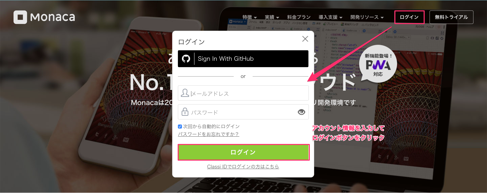

name: inverse
layout: true
class: center, middle, inverse
---
# 自己紹介アプリを作ろう！

.right[]

.footnote[
.left[
Copyright 2019 FUJITSU CLOUD TECHNOLOGIES LIMITED<br>
Created by natsumo ikeda
]
]

---
layout: true
class: center, middle, inverse_sub
---
## はじめに

---
layout: false
### 概要

自己紹介アプリを作りましょう！<br>作ったアプリを使って、みんなで自己紹介をしましょう。

.center[]


---
### 今日体験する内容
#### 「自己紹介アプリ」を作りましょう

1. 自己紹介アプリの下書き
1. アプリ作成ツール「Monaca」の準備
1. Monacaの使い方練習
1. 自己紹介アプリを作る①（パーツの書き方）
1. 自己紹介アプリを作る②（アレンジの仕方）
1. TRY：レベルアップ（コメント入力機能をつけよう）
  * コメント入力機能をつけよう
    1. 機能追加に欠かせない道具 ニフクラ mobile backend とは
    1. ニフクラ mobile backend の準備
    1. コピペで機能追加

#### 「自己紹介アプリ」を使って自己紹介をしましょう

* 自己紹介アプリにメッセージをお互いに書き合いましょう！

---
layout: true
class: center, middle, inverse_sub
---
## 1. 自己紹介アプリの下書き

---
layout: false
### 1. 自己紹介アプリの下書き

ワークシートに作成する内容を自己紹介アプリの下書きしましょう。

.center[]

---
### 1. 自己紹介アプリの下書き

こんな感じで書けていればOK！下書きの内容をアプリにしていきましょう。

.center[]

---
layout: true
class: center, middle, inverse_sub
---
## 2. アプリ作成ツール「Monaca」の準備

---
layout: false
### 2. アプリ作成ツール「Monaca」の準備

アプリを作るのに「Monaca」という開発ツールを使います。Monacaは子ども向けの開発ツールではありません！実際に世の中にある様々なアプリがMonacaで作られています。開発言語は HTML/JavaScript/CSS を使います。今日は主に .color_blue[__HTML__] の書き方を学んでいきます。

.center[]


---
### 2. アプリ作成ツール「Monaca」の準備

事前準備・開発環境を確認しましょう。

* Chrome 最新版
  * https://www.google.com/chrome/
* Gmail（メールアドレス） の取得
  * https://accounts.google.com/signup

アプリ作成ツールのアカウントを作成しましょう。

* Monaca 利用登録（無料）
  * https://monaca.mobi/ja/signup

<br><br>
.size_small_7[
（任意）スマートフォンがあれば、動作確認をスマホでできます👌

* Monacaデバッガー 最新版
  * https://ja.monaca.io/debugger.html
]

---
layout: false
### 2. アプリ作成ツール「Monaca」の準備

Monaca にログインしましょう。<br>https://ja.monaca.io/

.center[]

---
### 2. アプリ作成ツール「Monaca」の準備

プロジェクトを作りましょう。「新しいプロジェクトを作る」をクリックします。

.center[]

---
### 2. アプリ作成ツール「Monaca」の準備

「最小限のテンプレート」をクリックします。

.center[]

---
### 2. アプリ作成ツール「Monaca」の準備

プロジェクト名に「自己紹介アプリ」と入力して「作成」をクリックします。

.center[]

---
### 2. アプリ作成ツール「Monaca」の準備

プロジェクトが作成されました。作成されたプロジェクトを開きましょう。作成されたプロジェクト「自己紹介アプリ」をクリックします。

.center[]

---
### 2. アプリ作成ツール「Monaca」の準備

右側に画面が開きます。 「クラウドIDEで開く」をクリックします。

.center[]

---
### 2. アプリ作成ツール「Monaca」の準備

プロジェクトが開かれました。この画面を触って、アプリを作っていきます💪

.center[]

---
layout: true
class: center, middle, inverse_sub
---
## 3. Monacaの使い方練習

---
layout: false
### 3. Monacaの使い方練習

Monacaの開発画面は次のようになっています。

.center[]


---
### 3. Monacaの使い方練習

それでは使い方の練習をしていきましょう。最初から開かれている index.html ファイルをみてください。 `<body>`と`</body>`の間に書かれた文字がプレビュー画面にも出ていますね👀

.center[]

`<body>`,`</body>` は「bodyタグ」と言って、bodyタグの間に記述した内容がアプリの画面に表示される仕組みになっています。

---
### 3. Monacaの使い方練習

bodyタグ内を編集してみましょう。書いてある英語を消して、「こんにちは！」と書き換えてみてください。

.center[]

---
### 3. Monacaの使い方練習

あれ？編集したけどプレビュー画面が変わらないね😢
プレビュー画面に反映させるには編集したファイル index.html の保存が必要です。保存するには「.color_blue[Ctrl]」+「.color_blue[S]」キーを同時に押してみましょう。

.center[]


---
### 3. Monacaの使い方練習

index.html が保存されて、プレビュー画面も更新されましたね😘

.center[]

練習はおしまいです！いよいよアプリを作っていきますよ🤩
---
layout: true
class: center, middle, inverse_sub
---
## 4. 自己紹介アプリを作る①<br>（パーツの書き方）

---
layout: false

### 4. 自己紹介アプリを作る①（パーツの書き方）

下書きを元に、`<body>`と`</body>`の間を編集して自己紹介アプリを作ってみましょう！完成イメージはこんな感じです。

.center[]

作業に入る前にいくつかパーツを紹介します☝️


---
### 4. 自己紹介アプリを作る①（パーツの書き方）

* 見出し（タイトル・サブタイトル・小見出し）
 * 見出しにしたい部分を h1タグ（ `<h1>`, `</h1>` ）で囲む
 * h1タグで指定した見出しの中の小見出しには h2タグ を使う
 * h1, h2, h3, …と見出しの大きさは１が一番大きく、数字が大きくなると小さくなります

```html
<h1>見出し1</h1>
<h2>見出し2</h2>
<h3>見出し3</h3>
```

.center[]


---
### 4. 自己紹介アプリを作る①（パーツの書き方）

* 段落（自己紹介文）
  * 段落にしたい部分を pタグ（ `<p>`, `</p>` ）で囲む

```html
<p>段落1</p>
<p>段落2</p>
<p>段落3</p>
```

.center[]

---
### 4. 自己紹介アプリを作る①（パーツの書き方）

見出しと段落を組み合わせて自己紹介アプリの下書きの内容を画面の中に作ってみましょう！

.center[]

---
### 4. 自己紹介アプリを作る①（パーツの書き方）

見出しと段落を組み合わせて自己紹介アプリの下書きの内容を画面の中に作ってみましょう！

```html
<h1>私のホームページアプリ</h1>
<p>私の名前は○○　○○です。小学校○年生です。今学校では○○を勉強しています。</p>
<h2>私の好きなもの</h2>
<h3>食べ物</h3>
<p>ハンバーグ・餃子</p>
<h3>趣味</h3>
<p>バスケ、算数</p>
```

.center[]

---
### 4. 自己紹介アプリを作る①（パーツの書き方）

文字の入力が終わったら、画像を入れてみましょう！（ちょっと難しくなるよ🙌）

* 画像を用意しましょう
  * ブラウザの別のタブを開いて、好きな画像をパソコンに保存しましょう
    * ファイル名「__image.png__」
    * 保存場所「__デスクトップ__」
* 用意した画像をアプリで表示するために、Monacaに画像をインポートしましょう
  * 画像を取り込むことを「インポート」すると言います☝️

.center[

.size_small_7[
ニフクラ mobile backend オリジナルキャラクター タカノくん
]
]

---
### 4. 自己紹介アプリを作る①（パーツの書き方）

編集している index.html と同じ場所に画像をインポートしましょう。
* 画面左のディレクトリの index.html で右クリックをします。開いた項目の「ファイルをアップロード」をクリックします。

.center[]

---
### 4. 自己紹介アプリを作る①（パーツの書き方）

* デスクトップに用意した画像をファイルアップロード画面に __ドラッグ＆ドロップ__ してファイルをアップロードします
  * マウスでクリックした状態のままファイルを移動して、指定の場所でクリックを解除（指を離す）することをドラッグ&ドロップと言います。

.center[]

* 正しくファイルがアップロードされるとディレクトリに追加されます
* 追加されていることを確認したらアップロード画面を閉じましょう

---
### 4. 自己紹介アプリを作る①（パーツの書き方）

* 改めてインポート出来たことを確認できました

.center[]

---
### 4. 自己紹介アプリを作る①（パーツの書き方）

インポートした画像を表示するには imgタグ を使います。
* `src` : 画像のパスを指定します
* `width` : 画像の横の長さを指定します
* `height` : 画像の縦の長さを指定します

```html

```

.center[]

---
### 4. 自己紹介アプリを作る①（パーツの書き方）

自己紹介アプリに画像を表示してみましょう。タイトル（h1タグ）の下に追加してみましょう。

.center[]

---
layout: true
class: center, middle, inverse_sub
---
## 5. 自己紹介アプリを作る②<br>（アレンジの仕方）

---
layout: false
### 5. 自己紹介アプリを作る②（アレンジの仕方）

ここまでで下書き通りには表示できるようになりました！ですが、このままだとちょっと殺風景ですね…せっかくなのでもう少しアレンジしてみましょう！

.center[]

---
### 5. 自己紹介アプリを作る②（アレンジの仕方）

* 背景の色変更
 * bodyタグに `bgcolor="色"` を追加
 * 下の例は背景が水色になる

```html
<body bgcolor="skyblue">
```

.center[]


色は、`blue`, `pink`, `red` など、英語表記で指定するかまたは __色コード__ で指定することができるよ☝️

.size_small_7[
> 参考リンク
> WEB色見本 原色大辞典 \- HTMLカラーコード
> https://www.colordic.org/
]

---
### 5. 自己紹介アプリを作る②（アレンジの仕方）
* 文字の色変更
  * 色を変えたい文字を fontタグ（ `<font color="色">`, `</font>` ）で囲む
  * 下の例は赤文字の「こんにちは」を表示します

```html
<font color="red">こんにちは</font>
```

.center[]

色の指定は背景と同じく英語表記か色コードで指定できるよ☝️


---
### 5. 自己紹介アプリを作る②（アレンジの仕方）
例えば、タイトルの一部だけを変えることもできるよ👍

```html
<h1>私の<font color="red">ホームページ</font>アプリ</h1>
```

.center[]


---
### 5. 自己紹介アプリを作る②（アレンジの仕方）

* 位置変更
 * 位置を変更したいタグに`align="***"`追加します
 * 下の例は段落（pタグ）の位置変更

```html
<p align="left">左揃え</p>
<p align="right">右揃え</p>
<p align="center">中央揃え</p>
```

.center[]

---
### 5. 自己紹介アプリを作る②（アレンジの仕方）

画像の位置変更をしたい場合は、画像を divタグ（ `<div align="***">`, `</div>`）で囲みましょう。

```HTML
<div align="center">画像</div>
```

.center[]

---
layout: true
class: center, middle, inverse_sub
---
## 6. TRY：レベルアップ（コメント入力機能をつけよう）

---
layout: false

### 6. TRY：レベルアップ（コメント入力機能をつけよう）

最後に特別な機能を追加しましょう🥰<br>と言っても、ちょっと難しいので __コピペ__ を使ってサクッと機能を追加しちゃいましょう。（コピペとはできたものをコピーしてペーストする（貼り付ける）ことです😋）

1. 機能追加に欠かせない道具 ニフクラ mobile backend とは
1. ニフクラ mobile backend の準備
1. コピペで機能追加

---
### 6.1. 機能追加に欠かせない道具<br>　　　　　ニフクラ mobile backend とは

スマートフォンアプリのクラウドデータベースサービスです。と言っても難しくてよくわからないと思います😵<br>
これから作る「コメント入力機能」で入力されたメッセージは、スマートフォン上ではなく「クラウド」に保存することができます。クラウドに保存すると、

* 将来的には入力したメッセージをみんなで共有することができます
* スマートフォンやアプリが壊れてもデータが無くなることはありません

.center[]

今回は、作ったアプリと一緒にメッセージデータが入った「クラウド」も一緒に持ち帰っていただこうと思います👍

---
### 6.2. ニフクラ mobile backend の準備

アカウントを作成しましょう。

* ニフクラ mobile backend 利用登録（無料）
  * https://mbaas.nifcloud.com/signup.htm

---
### 6.2. ニフクラ mobile backend の準備

ログインからアプリ新規作成まで

---
### 6.2. ニフクラ mobile backend の準備

SDK導入

---
### 6.2. ニフクラ mobile backend の準備

SDK初期化

```js
// ニフクラ mobile backend を使うための準備
var applicationKey = "YOUR_APPLICATION_KEY";
var clientKey = "YOUR_CLIENT_KEY";
var ncmb = new NCMB(applicationKey, clientKey);
```

---
### 6.3. コピペで機能追加

自己紹介を書いた `<body></body>` タグの一番下に、次の内容をコピペします。

```HTML
<!-- コメント入力機能 -->
<form name="messageForm">
  <input type="text" name="message" size="30" maxlength="20">
  <input type="button" value="送信" onclick="sendMessage();">
</form>
<!-- ログ表示 -->
<div id="log"></div>
```

これで画面にコメント入力欄が追加されますが、まだボタンを押した後の処理をコーディングしていないので、ボタンを押しても何も動きません。

---
### 6.3. コピペで機能追加

コメント入力をして、送信ボタンを押すとメッセージが保存されていくように処理を書きます。

* scriptタグ （`<script>`, `</script>`）内に次の内容をコピペします

.size_small_9[
```js
// メッセージが送信された時の処理
function sendMessage() {
  // 入力値
  var text = document.forms.messageForm.message.value;
  // 入力チェック
  if(text.length === 0) {
    // 画面に表示
    document.getElementById("log").innerText = "文字が入力されていません";
    // 処理中止
    return false;
  }
  // 保存先クラスを指定
  var MessageClass = ncmb.DataStore("MessageClass");
  // クラスのインスタンスを生成
  var messageClass = new MessageClass();
  // 値の設定と保存処理の実行
  messageClass.set("message", text)
              .save()
              .then(function(){
                /* 保存に成功した場合の処理 */
                // 画面に表示
                document.getElementById("log").innerText = "メッセージが保存されました！"
              })
              .catch(function(err){
                /* 保存に失敗した場合の処理 */
                // 画面に表示
                document.getElementById("log").innerText = "Error:" + err.code;
              });
}
```
]

---
### 6.3. コピペで機能追加

動作確認

---
layout: true
class: center, middle, inverse_sub
---
## アプリを使って自己紹介しよう！

---
layout: false

### アプリを使って自己紹介しよう！

自己紹介手順

---
layout: true
class: center, middle, inverse_sub
---
## まとめ

---
layout: false

### まとめ

まとめと参考書の紹介
