title: プロフィールアプリを作ろう！
class: animation-fade
layout: true

<!-- This slide will serve as the base layout for all your slides -->
<!-- .bottom-bar[
  {{title}}
] -->

---

class: impact

# {{title}}

.right[]

.footnote[
.left[
.size_small_7[
Copyright 2020 FUJITSU CLOUD TECHNOLOGIES LIMITED<br>
Created by natsumo ikeda
]
]
]
---
layout: true
class: center, middle, animation-fade
---
# はじめに

---
layout: false

# 何ができるの？
## プロフィールアプリを作りましょう

.col-6[
出来上がったら作ったアプリを使って<br>みんなで自己紹介（じこしょうかい）<br>をしましょう👍<br><br>メッセージ機能をつけて<br>お友達のアプリにコメントしましょう💬
]
.col-6[
.center[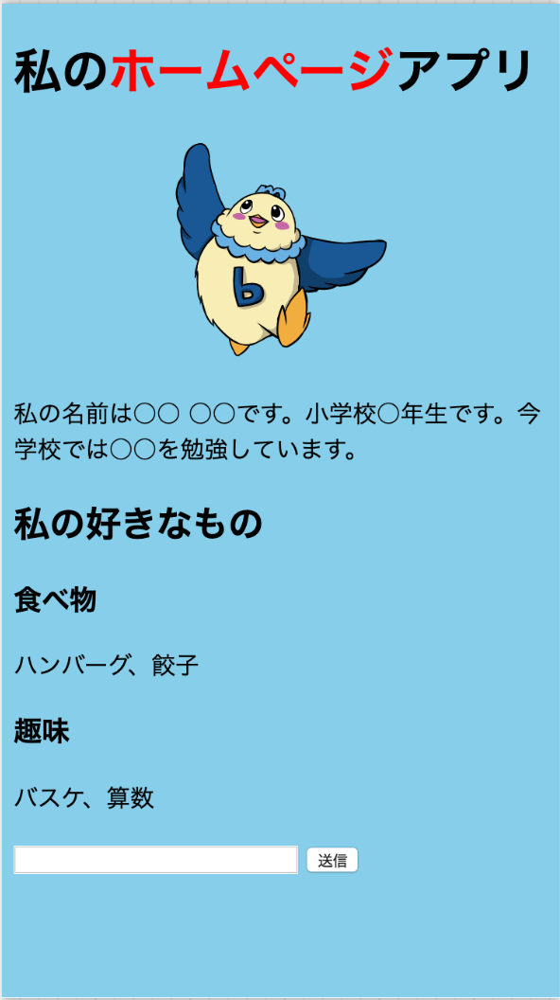]
]

.bottom-bar[
  はじめに
]

---
# これからやること

1. プロフィールアプリの下書き
1. アプリ作成ツール「Monaca」の準備
1. Monacaの使い方練習
1. プロフィールアプリを作る①（パーツの書き方）
1. プロフィールアプリを作る②（アレンジの仕方）
1. TRY：コメント入力機能をつけよう
    1. 機能追加に欠かせない道具 ニフクラ mobile backend とは
    1. ニフクラ mobile backend の準備
    1. コピペで機能追加
    1. 動作確認
1. アプリを使って自己紹介しよう！

.bottom-bar[
  はじめに
]

---
layout: true
class: center, middle, animation-fade
---
# 1. プロフィールアプリの下書き

---
layout: false

.bottom-bar[
  1.&nbsp;プロフィールアプリの下書き
]

ワークシートにプロフィールアプリの下書きをしましょう。

.center[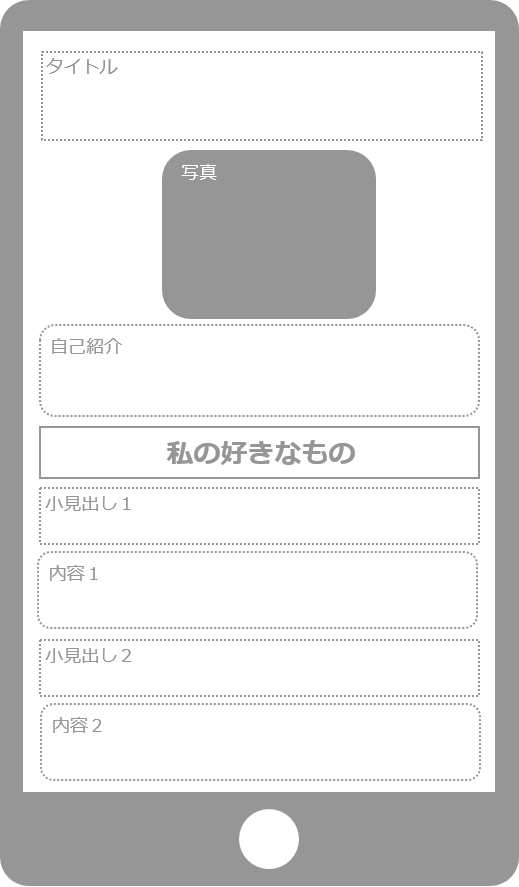]

---
.bottom-bar[
  1.&nbsp;プロフィールアプリの下書き
]

こんな感じで書けていればOK！下書きの内容をアプリにしていきましょう。

.center[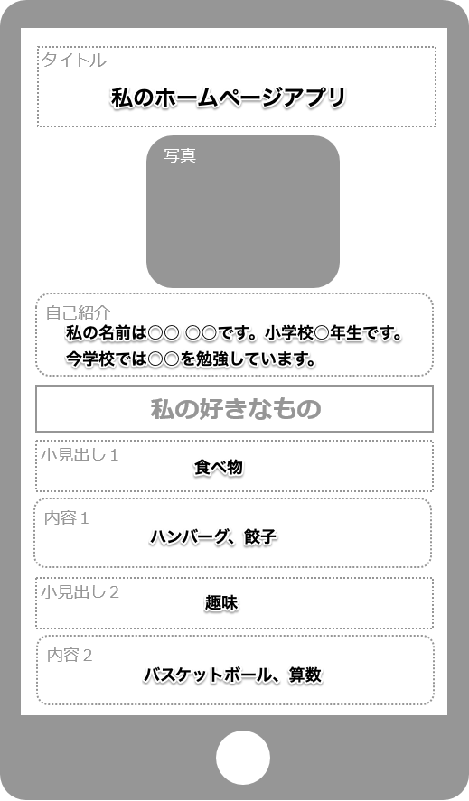]

---
layout: true
class: center, middle, animation-fade
---
# 2. アプリ作成ツール「Monaca」の準備

---
layout: false

.bottom-bar[
  2.&nbsp;アプリ作成ツール「Monaca」の準備
]

「.color_pink[__Monaca__]」という開発ツールを使ってアプリを作ります。Monacaは子ども向けの開発ツールではありません！プロのエンジニアも使っているツールです。プログラミングには開発言語というコンピューター専用の言葉を使います。Monacaでは HTML/JavaScript/CSS という比較的子どもでも取り組みやすい開発言語を使っています。今回は主に .color_pink[__HTML__] の書き方を学びましょう😉

.center[]


---
.bottom-bar[
  2.&nbsp;アプリ作成ツール「Monaca」の準備
]

## Monaca を使うために必要なもの
### パソコンに用意されているもの

* Google Chrome（ブラウザ）
  * https://www.google.com/chrome/

### 持ってきてもらったもの

* Gmail（メールアドレス）
  * https://accounts.google.com/signup

---
.bottom-bar[
  2.&nbsp;アプリ作成ツール「Monaca」の準備
]

## アプリ作成ツール「Monaca」のアカウントを作る

Google Chrome をダブルクリックしてブラウザを開きます。
.center[]

次のURLを入力してEnterキーを押します。<br>
https://monaca.mobi/ja/signup

.center[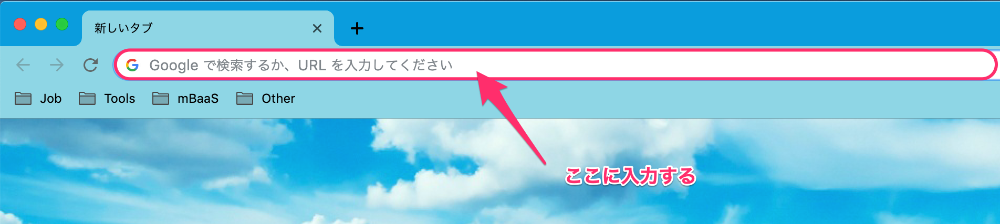]


---
.bottom-bar[
  2.&nbsp;アプリ作成ツール「Monaca」の準備
]

### 半角英語数字の入力をするには？

「ひらがな」が入力されてしまうときは、入力方法を切り替えましょう。

.center[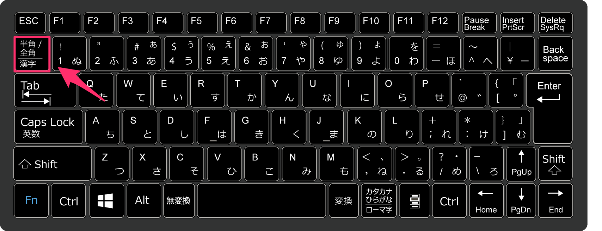]

---
.bottom-bar[
  2.&nbsp;アプリ作成ツール「Monaca」の準備
]

### 記号はどこ？

URLに含まれる「.」や「/」はここにあるよ！

.center[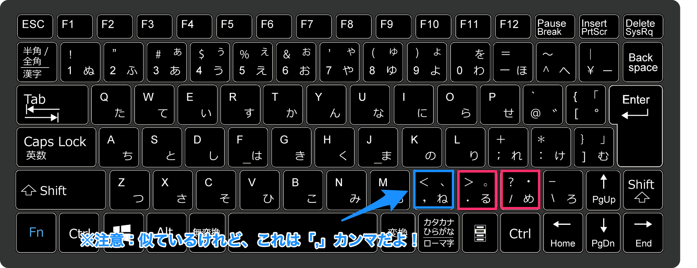]

---
.bottom-bar[
  2.&nbsp;アプリ作成ツール「Monaca」の準備
]

### ちなみに...

「.color_pink[__Enter__]」キーはここだよ！

.center[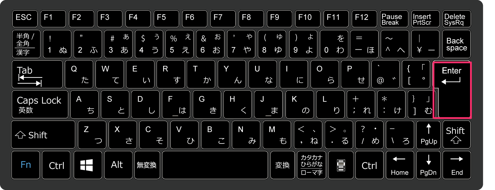]

---
.bottom-bar[
  2.&nbsp;アプリ作成ツール「Monaca」の準備
]

## アプリ作成ツール「Monaca」のアカウントを作る

.col-6[
Monacaのアカウント作成ページが開きます。<br>
Gmailのメールアドレスとパスワード（Gmailと同じでも違ってもどちらでもOK）を入力して「アカウント新規作成」をクリックします。
]
.col-6[
.center[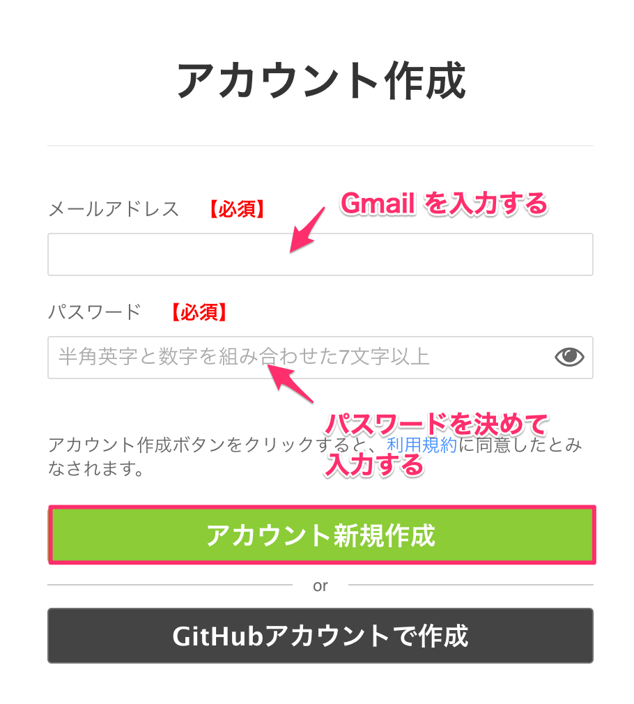]
]

---
.bottom-bar[
  2.&nbsp;アプリ作成ツール「Monaca」の準備
]

### 記号はどこ？

メールアドレスに含まれる「@」はここにあるよ！

.center[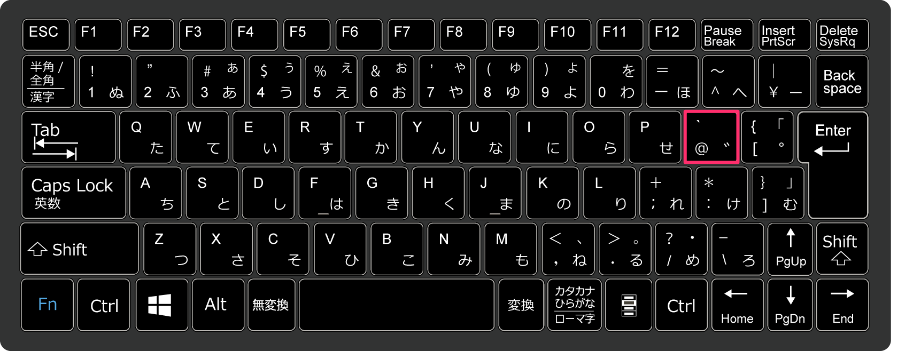]

---
.bottom-bar[
  2.&nbsp;アプリ作成ツール「Monaca」の準備
]

## アプリ作成ツール「Monaca」のアカウントを作る

.col-6[
Gmailにメールがとどきます。<br>
とどいたメールを確認しましょう。
]
.col-6[
.center[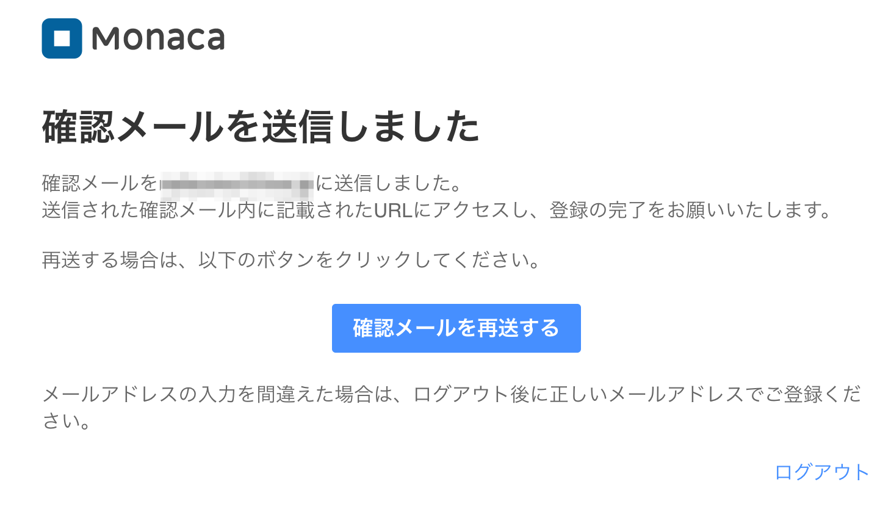]
]

---
.bottom-bar[
  2.&nbsp;アプリ作成ツール「Monaca」の準備
]

## アプリ作成ツール「Monaca」のアカウントを作る

.col-6[
Google Chrome で別のタブを開きます。
.center[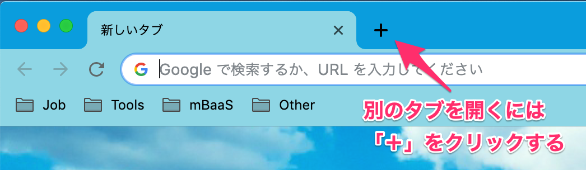]


次のURLを入力して Gmail を開きます。<br>
https://mail.google.com/<br><br>
Gmailを入力して、「次へ」をクリックします。
]
.col-6[
.center[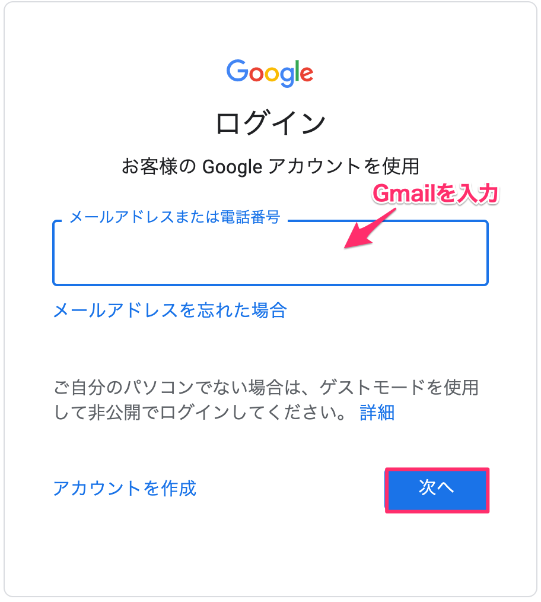]
]

---
.bottom-bar[
  2.&nbsp;アプリ作成ツール「Monaca」の準備
]

## アプリ作成ツール「Monaca」のアカウントを作る

.col-6[
Gmailのパスワードを入力して、「次へ」をクリックします。
]
.col-6[
.center[]
]

---
.bottom-bar[
  2.&nbsp;アプリ作成ツール「Monaca」の準備
]

## アプリ作成ツール「Monaca」のアカウントを作る

Gmailにログインできました。Monacaからのメールを確認しましょう。

.center[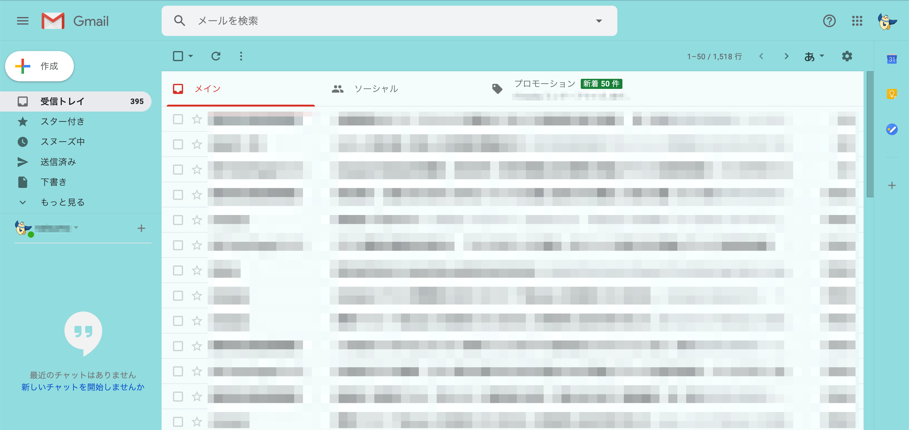]

---
.bottom-bar[
  2.&nbsp;アプリ作成ツール「Monaca」の準備
]

## アプリ作成ツール「Monaca」のアカウントを作る

Monacaからのメールを開いて「本登録はこちら」をクリックします。

.center[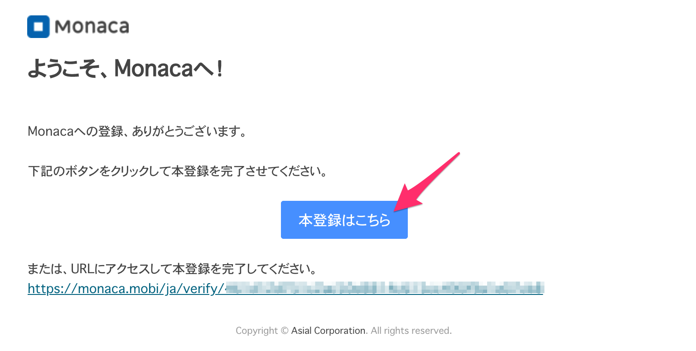]

---
.bottom-bar[
  2.&nbsp;アプリ作成ツール「Monaca」の準備
]

## アプリ作成ツール「Monaca」のアカウントを作る

.col-6[
別のタブが開いて、Monacaの「無料トライアルを開始」という画面が表示されます。<br>
「利用プラン選択」をクリックします。
]

.col-6[
.center[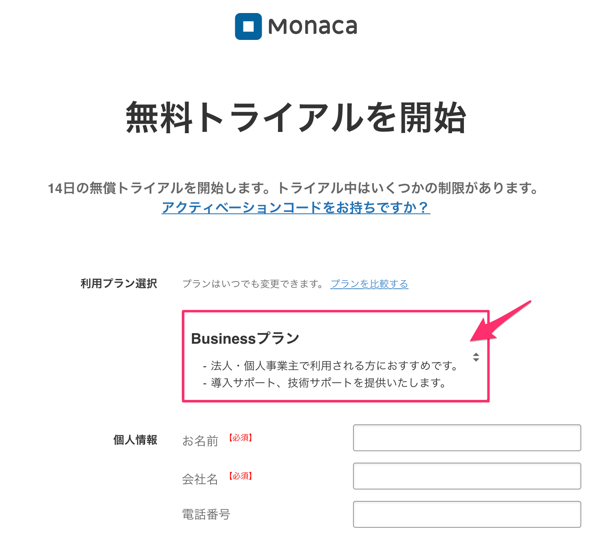]
]

---
.bottom-bar[
  2.&nbsp;アプリ作成ツール「Monaca」の準備
]

## アプリ作成ツール「Monaca」のアカウントを作る

.col-6[
「Freeプラン」をクリックします。
]

.col-6[
.center[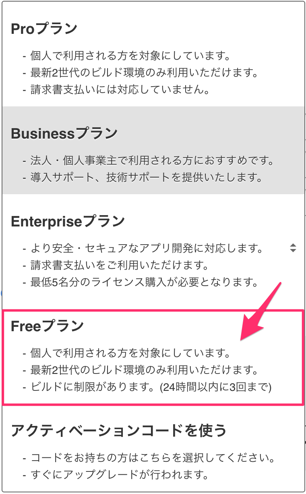]
]

---
.bottom-bar[
  2.&nbsp;アプリ作成ツール「Monaca」の準備
]

## アプリ作成ツール「Monaca」のアカウントを作る

.col-6[
「お名前」のみ入力して「無料トライアル開始」をクリックします。
]

.col-6[
.center[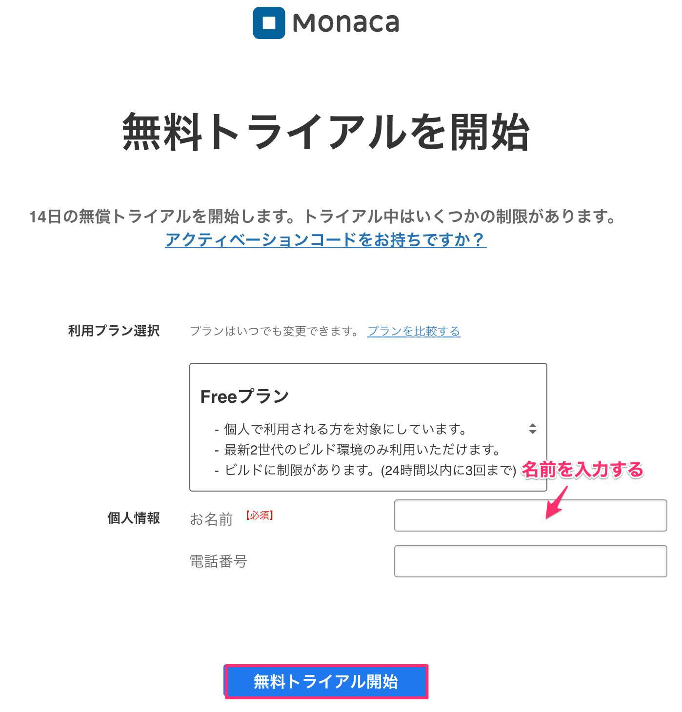]
]

---
.bottom-bar[
  2.&nbsp;アプリ作成ツール「Monaca」の準備
]

### ひらがな・カタカナや漢字を入力するには？

半角英語数字入力からひらがな・カタカナや漢字の入力に変更するときは、もう一度キーを押しましょう。

.center[]

---
.bottom-bar[
  2.&nbsp;アプリ作成ツール「Monaca」の準備
]

## アプリ作成ツール「Monaca」のアカウントを作る

「OK」をクリックします。

.center[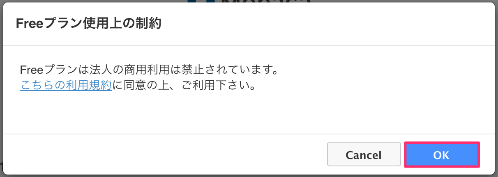]

---
.bottom-bar[
  2.&nbsp;アプリ作成ツール「Monaca」の準備
]

## アプリ作成ツール「Monaca」のアカウントを作る

.col-6[
Monacaアカウントの作成は完了です🎉<br>
「ダッシュボードに進む」をクリックしましょう。
]

.col-6[
.center[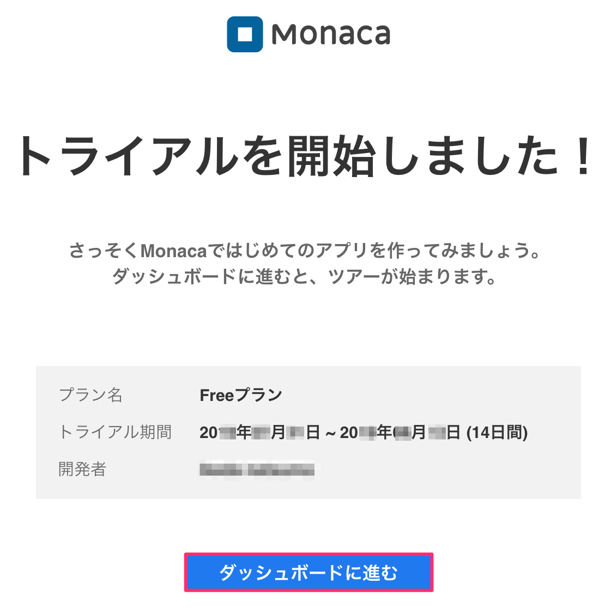]
]

---
.bottom-bar[
  2.&nbsp;アプリ作成ツール「Monaca」の準備
]

## アプリ作成ツール「Monaca」のアカウントを作る

ダッシュボードが表示されました。

.center[]

.size_small_7[
.right[
（参考）お家でMonacaを使うときは、https://ja.monaca.io/ からログインして使いましょう☝️
]
]

---
.bottom-bar[
  2.&nbsp;アプリ作成ツール「Monaca」の準備
]

## プロジェクトを作る

「新しいプロジェクトを作る」をクリックします。

.center[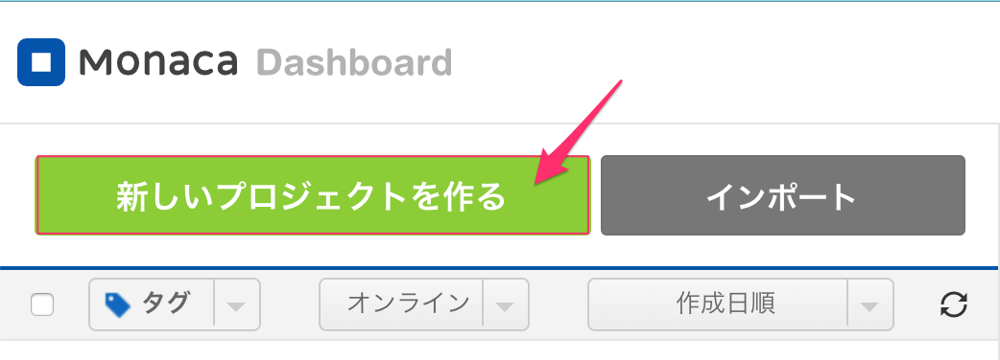]

---
.bottom-bar[
  2.&nbsp;アプリ作成ツール「Monaca」の準備
]

## プロジェクトを作る

「最小限のテンプレート」をクリックします。

.center[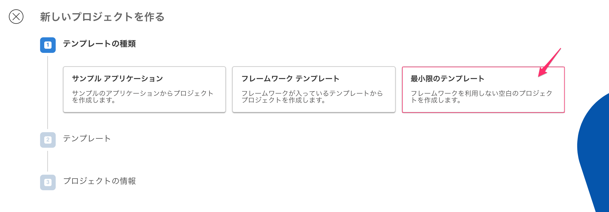]

---
.bottom-bar[
  2.&nbsp;アプリ作成ツール「Monaca」の準備
]

## プロジェクトを作る

プロジェクト名に「プロフィールアプリ」と入力して「作成」をクリックします。

.center[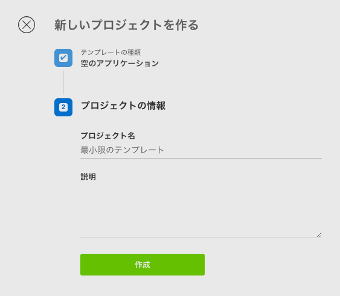]

---
.bottom-bar[
  2.&nbsp;アプリ作成ツール「Monaca」の準備
]

## プロジェクトを作る

プロジェクトが作成されました。作成されたプロジェクトを開きましょう。作成されたプロジェクト「プロフィールアプリ」をクリックします。

.center[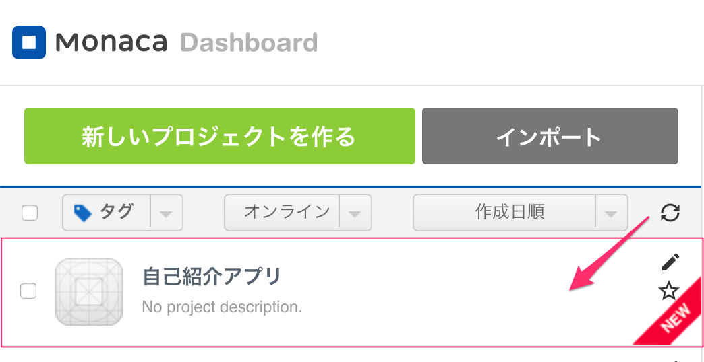]

---
.bottom-bar[
  2.&nbsp;アプリ作成ツール「Monaca」の準備
]

## プロジェクトを作る

右に画面が開きます。「クラウドIDEで開く」をクリックします。

.center[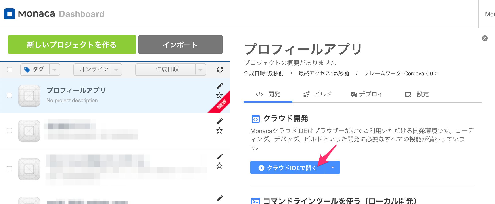]

---
.bottom-bar[
  2.&nbsp;アプリ作成ツール「Monaca」の準備
]

## プロジェクトを作る

プロジェクトが開かれました。この画面を触って、アプリを作っていきます💪

.center[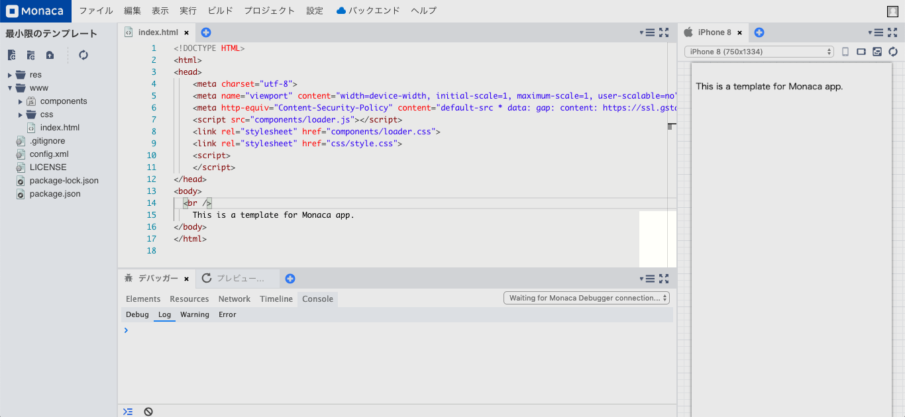]

---
layout: true
class: center, middle, animation-fade
---
# 3. Monacaの使い方練習

---
layout: false
.bottom-bar[
  3.&nbsp;Monacaの使い方練習
]

Monacaの開発画面は次のようになっています。

.center[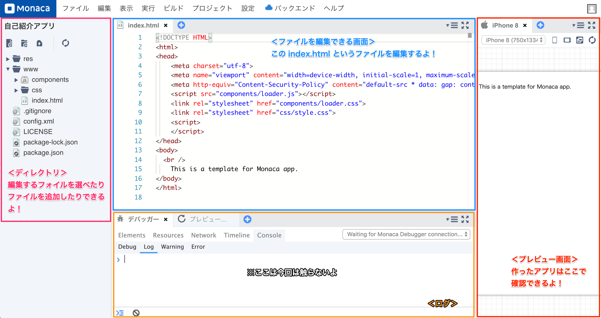]


---
.bottom-bar[
  3.&nbsp;Monacaの使い方練習
]

使い方の練習をしていきましょう。編集画面に初めから開かれている .color_pink[__index.html__] ファイルをみてください。<br>`<body>`と`</body>`の間に書かれた文字がプレビュー画面にも出ていますね👀

.center[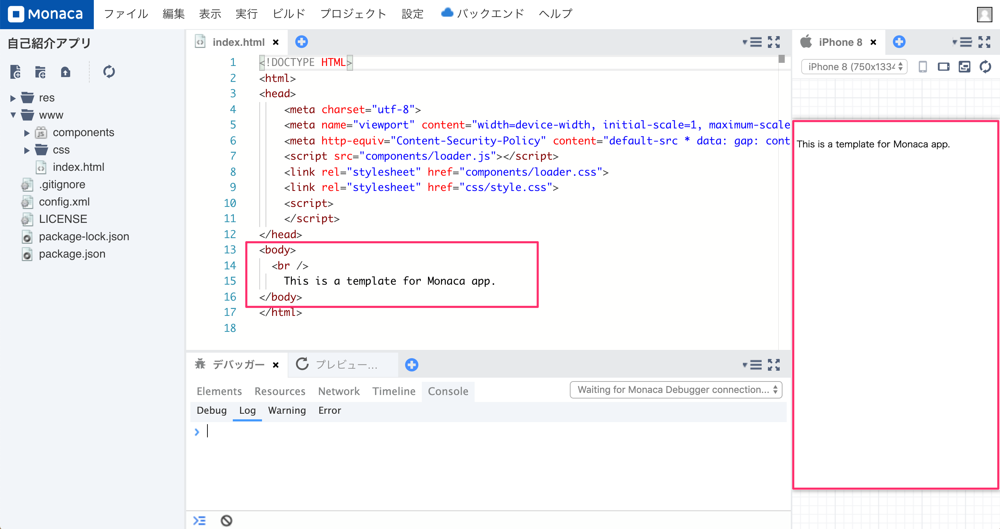]

---
.bottom-bar[
  3.&nbsp;Monacaの使い方練習
]

`<body>`,`</body>` は「.color_pink[__bodyタグ__]」と言います。<br>
bodyタグの間に書いた内容がアプリの画面に表示される仕組みになっています。<br>
一度bodyタグ内を全て消して書き直してみましょう。<br><br>

.center[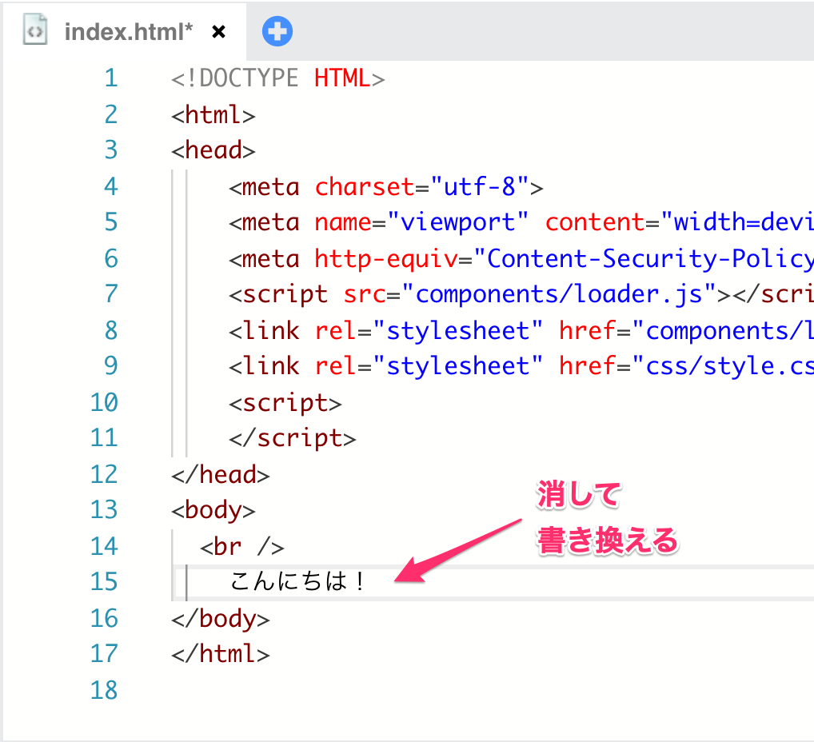]

---
.bottom-bar[
  3.&nbsp;Monacaの使い方練習
]

### ちなみに...

「.color_pink[__Back Space__]」キーはここだよ！

.center[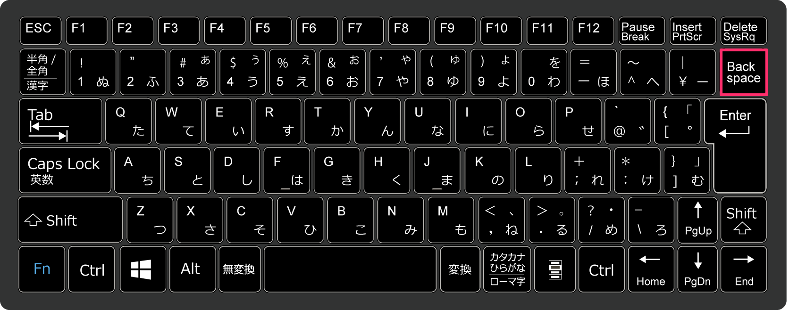]


---
.bottom-bar[
  3.&nbsp;Monacaの使い方練習
]

全部消したら「__こんにちは！__」と書いてみましょう。<br><br>

.center[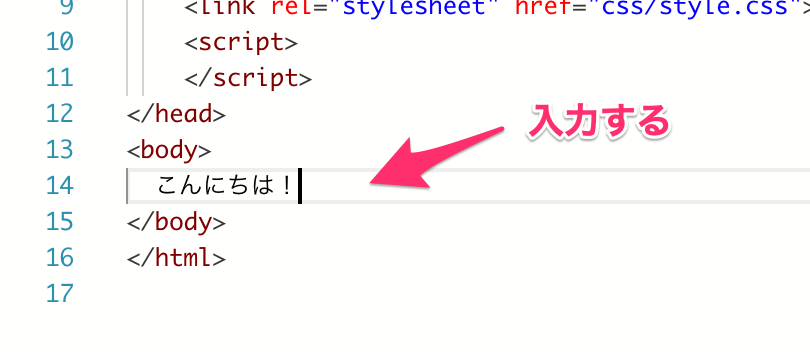]

---
.bottom-bar[
  3.&nbsp;Monacaの使い方練習
]

あれ？書き直したけどプレビュー画面が変わらないね😢<br>
プレビュー画面に正しく表示させるには編集したファイル（index.html）を.color_pink[__保存__]しなければなりません。

.center[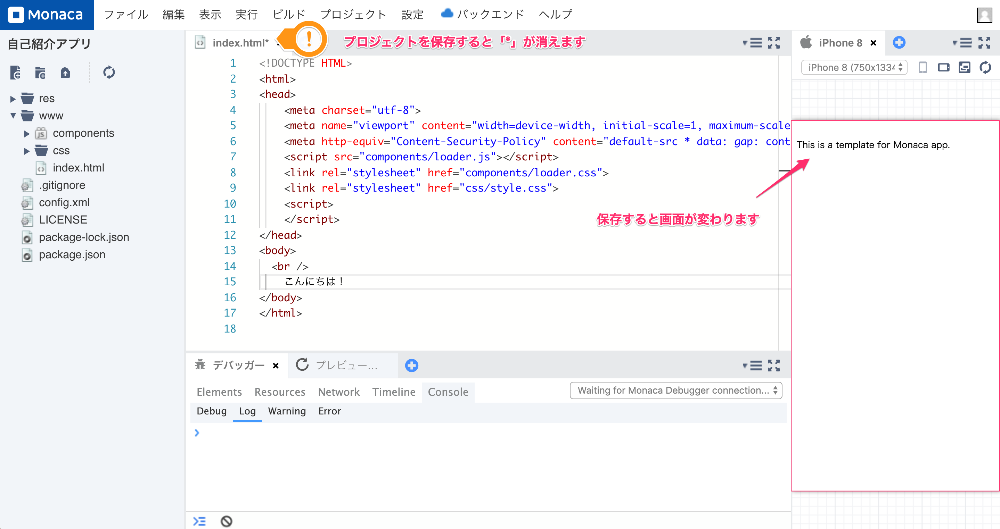]

---
.bottom-bar[
  3.&nbsp;Monacaの使い方練習
]

「.color_pink[__Ctrl__]」+「.color_pink[__S__]」キーを同時に押して、保存をしてみましょう。

.center[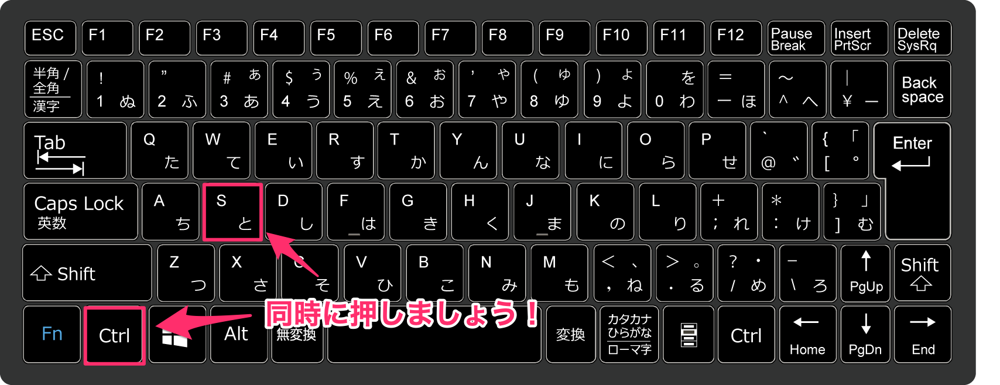]

---
.bottom-bar[
  3.&nbsp;Monacaの使い方練習
]

index.html が保存されて、プレビュー画面も更新されましたね😘

.center[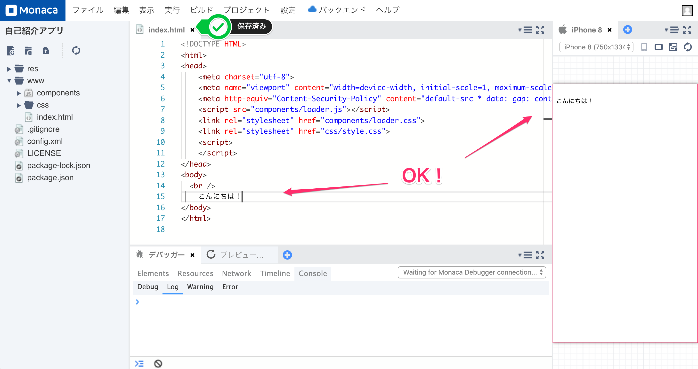]

練習はおしまいです！いよいよアプリを作っていきますよ🤩

---
layout: true
class: center, middle, animation-fade
---
# 4. プロフィールアプリを作る①<br>（パーツの書き方）

---
layout: false

.bottom-bar[
  4.&nbsp;プロフィールアプリを作る①（パーツの書き方）
]

さっき下書きした内容をアプリに表示するように`<body>`と`</body>`の間に書き込んで行きましょう。<br>
完成イメージはこんな感じです。

.center[]

でもどうやって書いたらいいのかな？？書くために必要なパーツを教えます☝️

---
.bottom-bar[
  4.&nbsp;プロフィールアプリを作る①（パーツの書き方）
]

## 見出し（タイトル・サブタイトル・小見出し）
* 見出しにしたい部分を h1タグ（ `<h1>`, `</h1>` ）で囲む
* h1タグで囲った見出しより小さい見出しには h2タグ を使います
* h1, h2, h3, …と見出しの大きさは１が一番大きく、数字が大きくなると小さくなります

```html
<h1>見出し1</h1>
<h2>見出し2</h2>
<h3>見出し3</h3>
```

---
.bottom-bar[
  4.&nbsp;プロフィールアプリを作る①（パーツの書き方）
]

## 見出し（タイトル・サブタイトル・小見出し）

```html
<h1>見出し1</h1>
<h2>見出し2</h2>
<h3>見出し3</h3>
```

.center[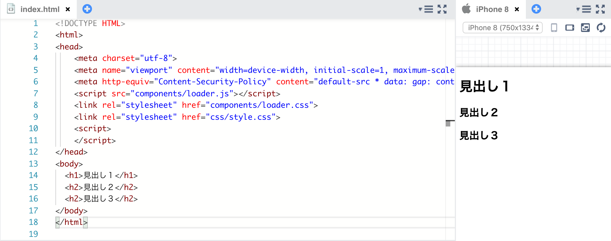]


---
.bottom-bar[
  4.&nbsp;プロフィールアプリを作る①（パーツの書き方）
]

## 段落（自己紹介文）
* 段落にしたい部分を pタグ（ `<p>`, `</p>` ）で囲む

```html
<p>段落1</p>
<p>段落2</p>
<p>段落3</p>
```

---
.bottom-bar[
  4.&nbsp;プロフィールアプリを作る①（パーツの書き方）
]

## 段落（自己紹介文）

```html
<p>段落1</p>
<p>段落2</p>
<p>段落3</p>
```

.center[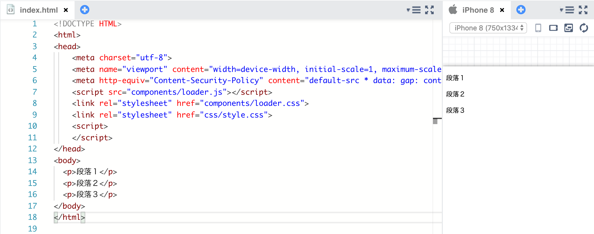]

---
.bottom-bar[
  4.&nbsp;プロフィールアプリを作る①（パーツの書き方）
]

### タグを使わないで書くとどうなるの？

改行（行がかわること）して書いても、<br>アプリ側では改行されずに表示されてしまいます😖

.center[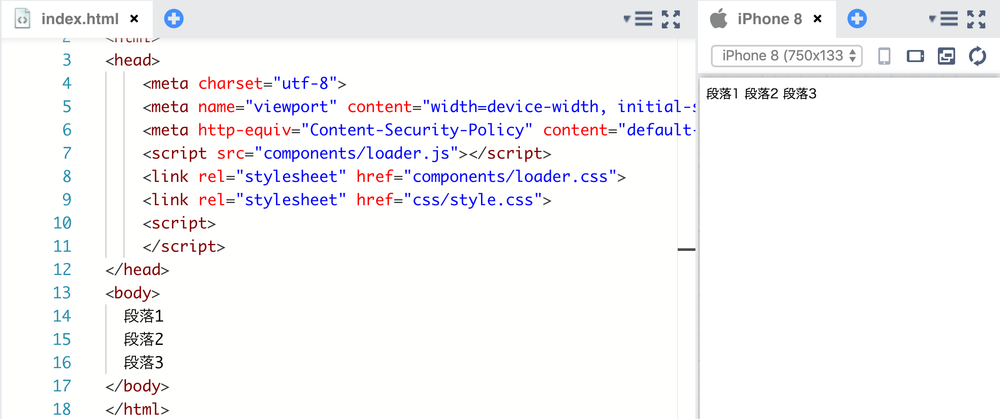]


---
.bottom-bar[
  4.&nbsp;プロフィールアプリを作る①（パーツの書き方）
]

.color_pink[__見出し__]と.color_pink[__段落__]を組み合わせて、下書きした内容を画面の中に作ってみましょう！

.center[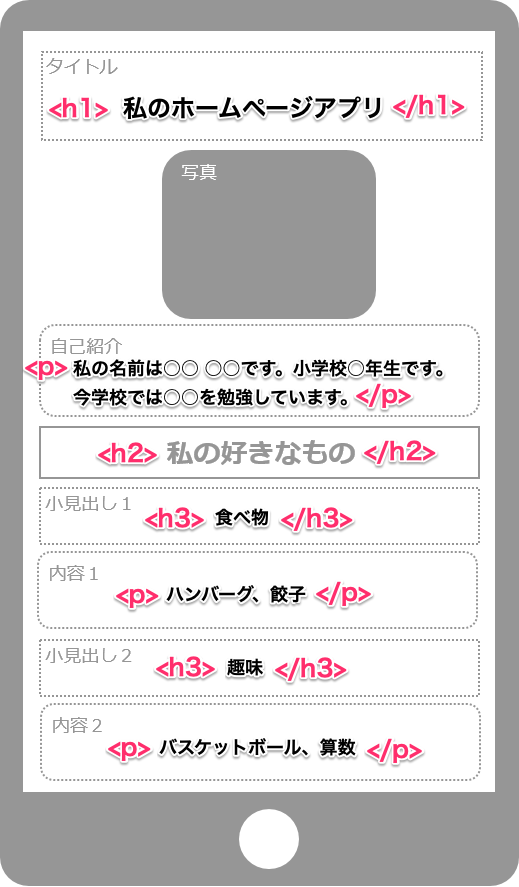]

---
.bottom-bar[
  4.&nbsp;プロフィールアプリを作る①（パーツの書き方）
]

.color_pink[__見出し__]と.color_pink[__段落__]を組み合わせて、下書きした内容を画面の中に作ってみましょう！

```html
<h1>私のホームページアプリ</h1>
<p>私の名前は○○　○○です。小学校○年生です。今学校では○○を勉強しています。</p>
<h2>私の好きなもの</h2>
<h3>食べ物</h3>
<p>ハンバーグ・餃子</p>
<h3>趣味</h3>
<p>バスケ、算数</p>
```

---
.bottom-bar[
  4.&nbsp;プロフィールアプリを作る①（パーツの書き方）
]

.color_pink[__見出し__]と.color_pink[__段落__]を組み合わせて、下書きした内容を画面の中に作ってみましょう！

.center[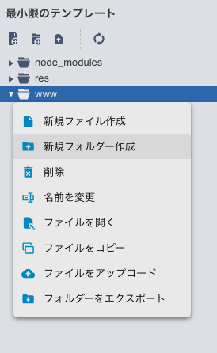]

---
.bottom-bar[
  4.&nbsp;プロフィールアプリを作る①（パーツの書き方）
]

### 記号はどこ？

タグ含まれる「<」,「>」はここにあるよ！<br>
ボタンの上の行に書かれている記号を入力するときは「Shift」ボタンを押しながら入力します。

.center[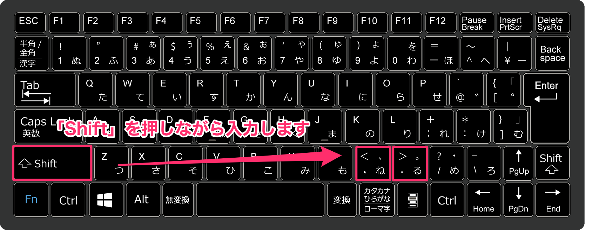]


---
.bottom-bar[
  4.&nbsp;プロフィールアプリを作る①（パーツの書き方）
]

## 画像

文字の入力が終わったら、画像を入れてみましょう！（ちょっと難しくなるよ🙌）

.center[

]


---
.bottom-bar[
  4.&nbsp;プロフィールアプリを作る①（パーツの書き方）
]

## 画像
### 画像の準備

ブラウザで別のタブを開いて、好きな画像を探しましょう。<br>
画像が決まったら画面に表示しておきましょう。

.col-7[
＜例＞
* http://bit.ly/mb_takano をブラウザの別のタブで開く
* タカノくんの画像が表示される
]

.col-5[
.center[

]
]

---
.bottom-bar[
  4.&nbsp;プロフィールアプリを作る①（パーツの書き方）
]

## 画像
### 画像の準備

画像の上で右クリックをして、「名前を付けて画像を保存」をクリックします。

.center[
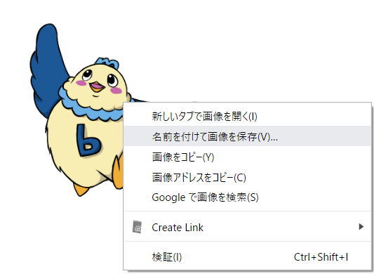
]

---
.bottom-bar[
  4.&nbsp;プロフィールアプリを作る①（パーツの書き方）
]

## 画像
### 画像の準備

保存画面が開いたら、保存場所とファイル名を次のようにしましょう。

.col-5[
* 保存場所「__デスクトップ__」
* ファイル名「__image.png__」

できたら「保存」をクリックします。
]

.col-7[
.center[
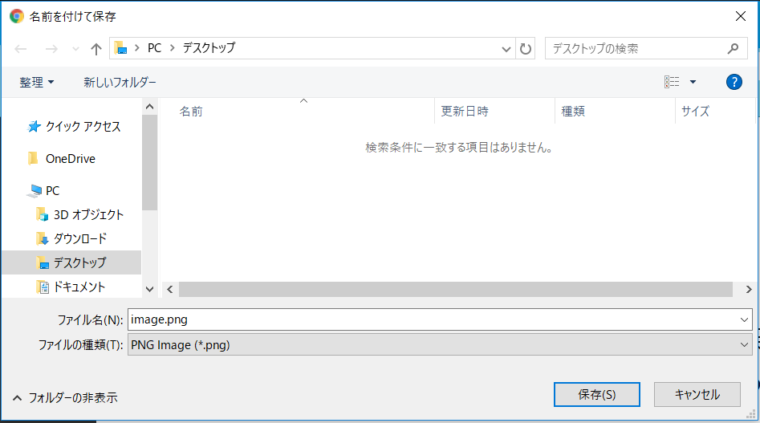
]
]

---
.bottom-bar[
  4.&nbsp;プロフィールアプリを作る①（パーツの書き方）
]

## 画像
### 画像の準備

デスクトップを確認しましょう。画像が表示されていればOKです。

.center[

]

---
.bottom-bar[
  4.&nbsp;プロフィールアプリを作る①（パーツの書き方）
]

## 画像
### Monacaへのインポート

用意した画像をアプリで表示するために、Monacaにインポート（Monacaに取り込むこと）しましょう。<br>
ブラウザで先ほど開いていた.color_pink[__Monacaの開発画面のタブ__]を開きます。<br>
（先ほどの画面に戻ります。）

.center[
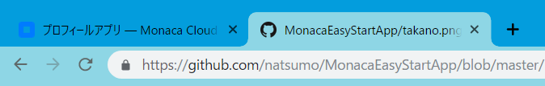
]

---
.bottom-bar[
  4.&nbsp;プロフィールアプリを作る①（パーツの書き方）
]

## 画像
.col-5[
### Monacaへのインポート

編集している index.html と同じ場所に画像をインポートしましょう。<br>
ファイルディレクトリ画面の index.html で.color_pink[__右クリック__]をします。開いた項目の「ファイルをアップロード」をクリックします。
]

.col-7[
.center[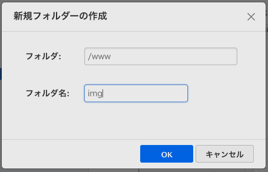]
]

---
.bottom-bar[
  4.&nbsp;プロフィールアプリを作る①（パーツの書き方）
]

## 画像
### Monacaへのインポート

.col-5[
デスクトップに用意した画像をファイルアップロード画面に.color_pink[__ドラッグ＆ドロップ__]してファイルをアップロードします。
.size_small_7[
（参考）マウスでクリックした状態のままファイルを移動して、指定の場所でクリックを解除（指を離す）することをドラッグ&ドロップと言います。
]
]
.col-7[
.center[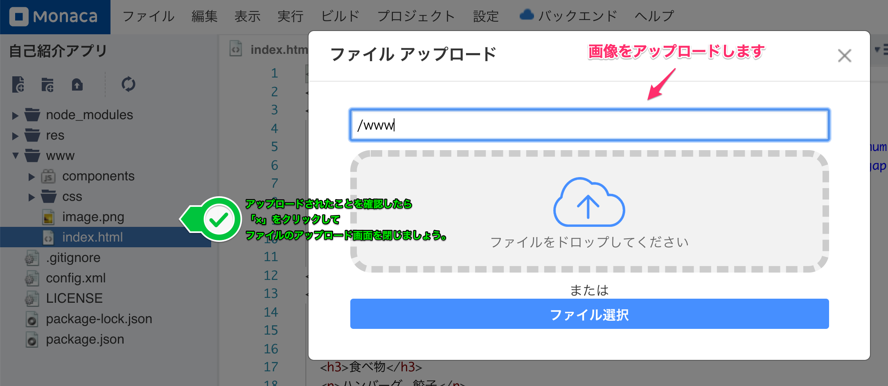]
]

---
.bottom-bar[
  4.&nbsp;プロフィールアプリを作る①（パーツの書き方）
]

## 画像
### Monacaへのインポート

.col-5[
正しくファイルがアップロードされるとディレクトリに追加されます。<br>
追加されていることを確認したらアップロード画面を「×」をクリックして閉じましょう。
]
.col-7[
.center[]
]

---
.bottom-bar[
  4.&nbsp;プロフィールアプリを作る①（パーツの書き方）
]

## 画像
.col-6[
### Monacaへのインポート

改めてファイルディレクトリ画面を確認しましょう。<br>
インポート出来たことを確認できました。
]
.col-6[
.center[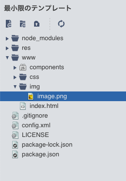]
]
---
.bottom-bar[
  4.&nbsp;プロフィールアプリを作る①（パーツの書き方）
]

## 画像

インポートした画像をアプリに表示するには imgタグ を使います。

* `src` : 画像のパスを指定します
* `width` : 画像の横の長さを指定します
* `height` : 画像の縦の長さを指定します

.center[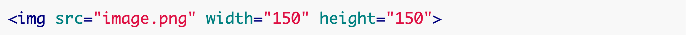]

---
.bottom-bar[
  4.&nbsp;プロフィールアプリを作る①（パーツの書き方）
]

## 画像

.center[]

.center[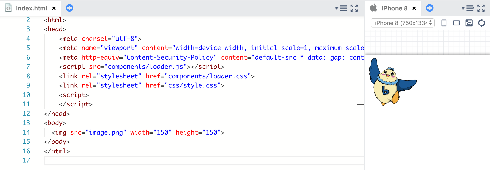]

---
.bottom-bar[
  4.&nbsp;プロフィールアプリを作る①（パーツの書き方）
]

プロフィールアプリに画像を表示してみましょう。タイトル（h1タグ）の下に追加してみましょう。

.center[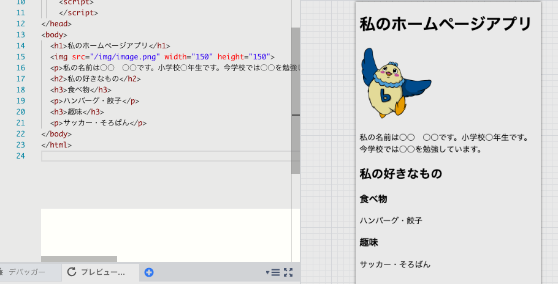]

---
.bottom-bar[
  4.&nbsp;プロフィールアプリを作る①（パーツの書き方）
]

### 記号はどこ？

imgタグに含まれる「"」,「=」はここにあるよ！

.center[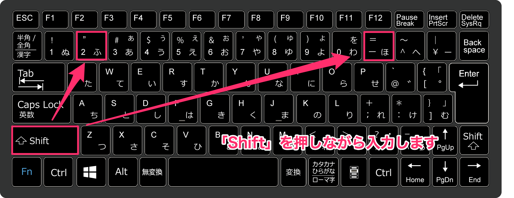]

---
layout: true
class: center, middle, animation-fade
---
# 5. プロフィールアプリを作る②<br>（アレンジの仕方）

---
layout: false

.bottom-bar[
  5.&nbsp;プロフィールアプリを作る②（アレンジの仕方）
]

.col-7[
ここまでで下書き通りには表示できるようになりました！<br>
ですが、このままだとちょっと殺風景ですね…<br>せっかくなのでもう少し.color_pink[__アレンジ__]してみましょう！
]
.col-5[
.center[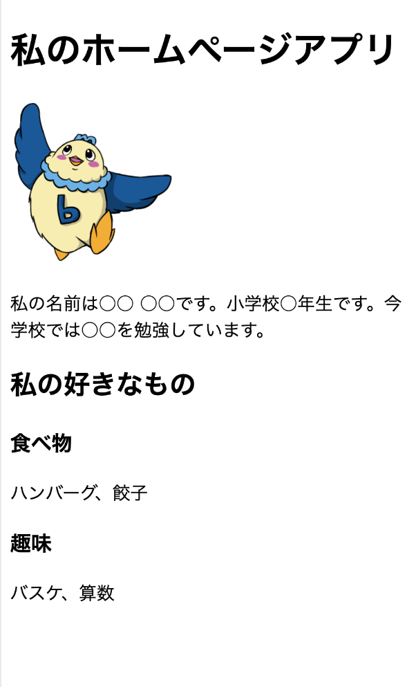]
]

---
.bottom-bar[
  5.&nbsp;プロフィールアプリを作る②（アレンジの仕方）
]

## 背景の色変更

* bodyタグに `bgcolor="色"` を追加します
* 下の例は背景を水色（skyblue）にします

```html
<body bgcolor="skyblue">
  ・・・
</body>
```

---
.bottom-bar[
  5.&nbsp;プロフィールアプリを作る②（アレンジの仕方）
]

## 背景の色変更

```html
<body bgcolor="skyblue">
  ・・・
</body>
```

.center[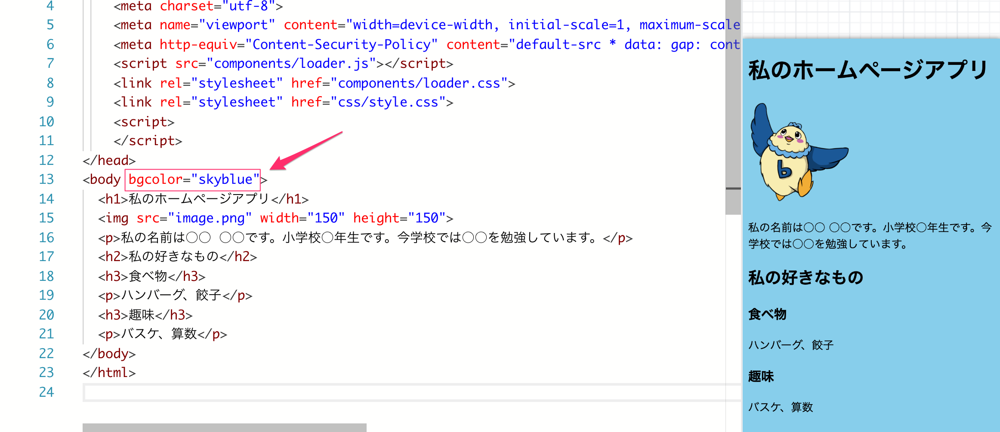]

---
.bottom-bar[
  5.&nbsp;プロフィールアプリを作る②（アレンジの仕方）
]

## 背景の色変更

```html
<body bgcolor="skyblue">
  ・・・
</body>
```

色は、青：`blue`, ピンク：`pink`, 赤：`red` など、<br>
色名の.color_pink[__英語表記__]または.color_pink[__色コード__]で指定することができるよ☝️

.col-6[
＜例＞ タカノ君の羽の青色： `#006cb4`

.size_small_7[
> 参考リンク<br>
> WEB色見本 原色大辞典 \- HTMLカラーコード<br>
> https://www.colordic.org/
]
]

.col-6[
.center[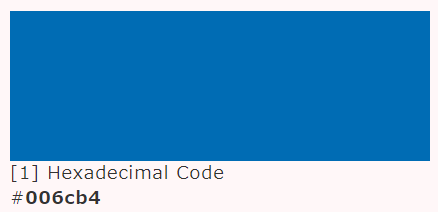]
]

---
.bottom-bar[
  5.&nbsp;プロフィールアプリを作る②（アレンジの仕方）
]

## 文字の色変更

* 色を変えたい文字を fontタグ（ `<font color="色">`, `</font>` ）で囲む
* 下の例は赤文字の「こんにちは」を表示します

```html
<font color="red">こんにちは</font>
```

---
.bottom-bar[
  5.&nbsp;プロフィールアプリを作る②（アレンジの仕方）
]

## 文字の色変更

```html
<font color="red">こんにちは</font>
```

.center[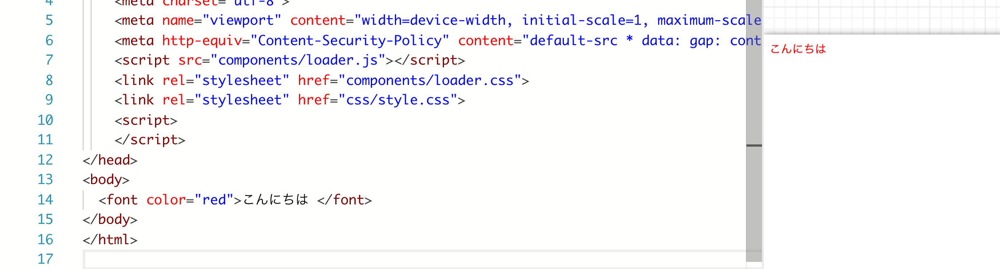]

色の指定方法は背景色と同じく英語表記か色コードで指定できるよ☝️


---
.bottom-bar[
  5.&nbsp;プロフィールアプリを作る②（アレンジの仕方）
]

## 文字の色変更

＜例＞タイトルの一部だけを変えることもできるよ👍

```html
<h1>私の<font color="red">ホームページ</font>アプリ</h1>
```

.center[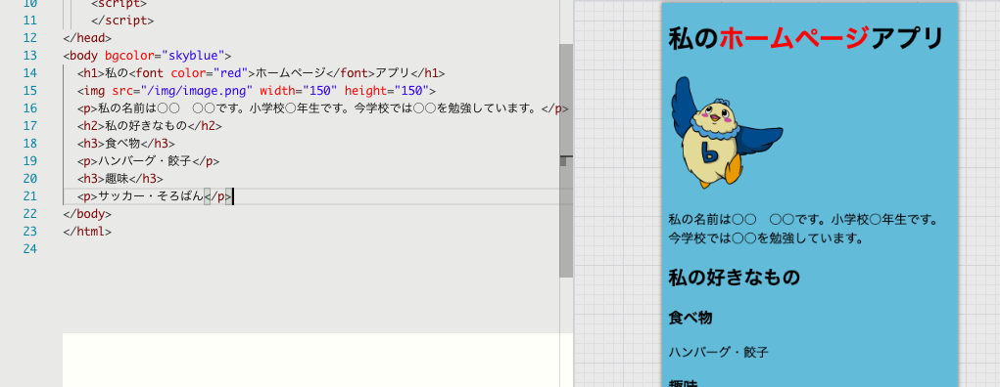]


---
.bottom-bar[
  5.&nbsp;プロフィールアプリを作る②（アレンジの仕方）
]

## 位置の変更

* 位置を変更したいタグに`align`を追加します
* 下の例は段落（pタグ）の位置を変更します

```html
<p align="left">左揃え</p>
<p align="right">右揃え</p>
<p align="center">中央揃え</p>
```

---
.bottom-bar[
  5.&nbsp;プロフィールアプリを作る②（アレンジの仕方）
]

## 位置の変更

```html
<p align="left">左揃え</p>
<p align="right">右揃え</p>
<p align="center">中央揃え</p>
```

.center[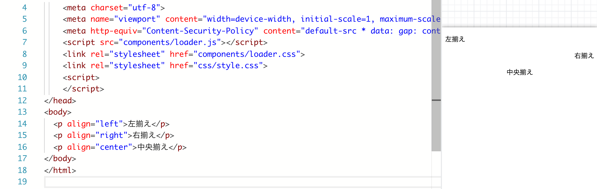]

---
.bottom-bar[
  5.&nbsp;プロフィールアプリを作る②（アレンジの仕方）
]

## 位置の変更
### 画像の位置変更をしたい場合

* 画像（imgタグ）を pタグ（ `<p align="***">`, `</p>`）で囲みましょう。

```HTML
<p align="center">画像</p>
```

---
.bottom-bar[
  5.&nbsp;プロフィールアプリを作る②（アレンジの仕方）
]

## 位置の変更
### 画像の位置変更をしたい場合

```HTML
<p align="center">画像</p>
```

.center[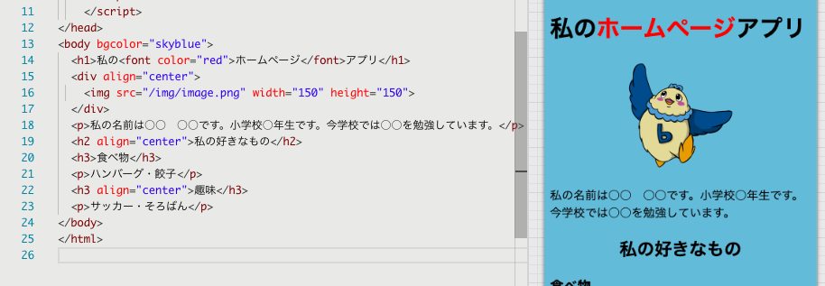]

---
.bottom-bar[
  5.&nbsp;プロフィールアプリを作る②（アレンジの仕方）
]

いくつか画像を追加したり、色を変えたりしてプロフィールアプリをアレンジしてみましょう💪

.center[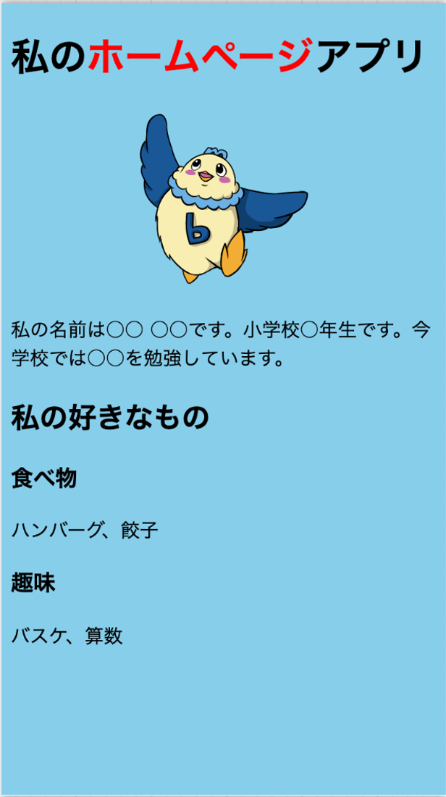]


---
layout: true
class: center, middle, animation-fade
---
# 6. TRY：コメント入力機能をつけよう

---
layout: false

.bottom-bar[
  6.&nbsp;TRY：コメント入力機能をつけよう
]

最後に.color_pink[__特別な機能__]を追加しましょう😉！<br>
できたプロフィールアプリをみんなに見せてコメントをもらえるようにしましょう😍<br>

.size_small_7[
この機能の追加はちょっと難しいので.color_pink[__コピペ__]（コピー＆ペースト（貼り付ける）のこと）を使ってサクッと機能を追加しちゃいましょう。
]

### これからやること

.col-6[
1. 機能追加に欠かせない道具 .color_pink[__ニフクラ mobile backend__] とは
1. ニフクラ mobile backend の準備
1. コピペで機能追加
1. 動作確認
]

.col-6[
.center[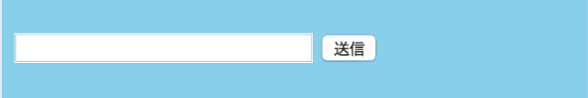]
]


---
.bottom-bar[
  6.&nbsp;TRY：コメント入力機能をつけよう
]

### 6.1. 機能追加に欠かせない道具ニフクラ mobile backend とは

スマートフォンアプリの.color_pink[__クラウドデータベース__]サービスです。<br>
と言っても難しくてよくわからないですよね…😵<br>
よくわからなくても実はアプリに欠かすことのできない存在なんです。<br>

.col-7[
＜例＞__メッセージ送信アプリ__<br>
送信したメッセージはスマホからスマホへ送られているわけではありません！<br>
一度クラウドに保存され相手に届けられる仕組みになっています。<br>
クラウドがなければ作ることができないわけですね。
]

.col-5[
.center[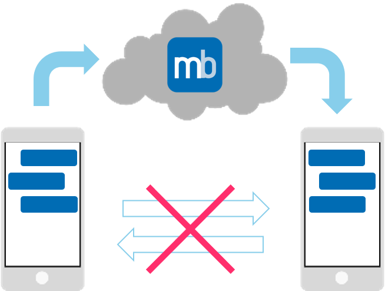]
]

---
.bottom-bar[
  6.&nbsp;TRY：コメント入力機能をつけよう
]

### 6.1. 機能追加に欠かせない道具ニフクラ mobile backend とは


.center[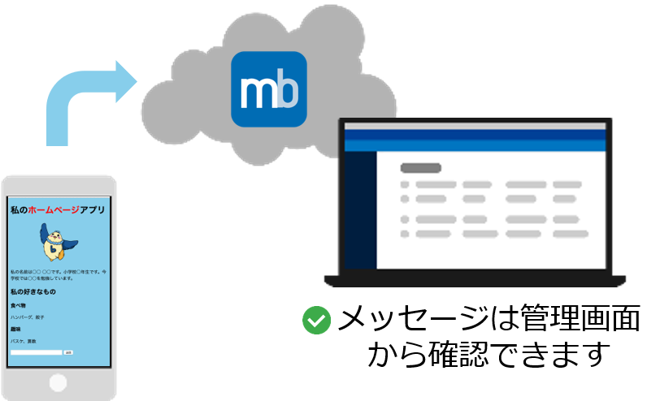]

これから作る「コメント入力機能」もクラウドを使って作ってみましょう。<br>
一人一人それぞれのクラウドを用意しますので、作ったアプリと一緒にメッセージデータが入った.color_pink[__クラウド__]も持ち帰ってもらえます👍

---
.bottom-bar[
  6.&nbsp;TRY：コメント入力機能をつけよう
]

### 6.2. ニフクラ mobile backend の準備

ニフクラ mobile backend の利用登録をしましょう。<br>
ブラウザで別のタブを開いて、次のURLを入力してEnterキーを押します。<br>
https://mbaas.nifcloud.com/

.center[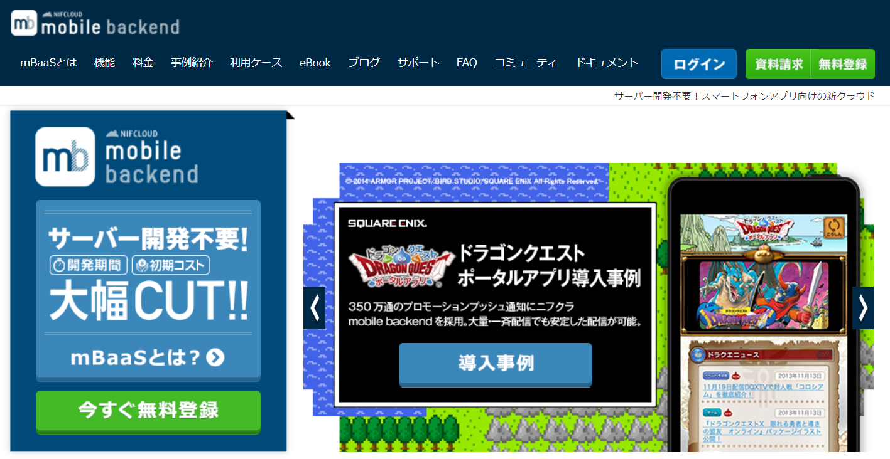]
.size_small_7[
（参考）URLを打たなくても「.color_pink[__mBaaS__]」と検索してもOK！一番上に出てくるサイトをクリックしましょう。
]

---
.bottom-bar[
  6.&nbsp;TRY：コメント入力機能をつけよう
]

### 6.2. ニフクラ mobile backend の準備

「無料登録」をクリックします。

.center[]

---
.bottom-bar[
  6.&nbsp;TRY：コメント入力機能をつけよう
]

### 6.2. ニフクラ mobile backend の準備

SNS ID として Gmail を使ってアカウントを作成します。<br>
「会員登録（無料）」をクリックします。

.center[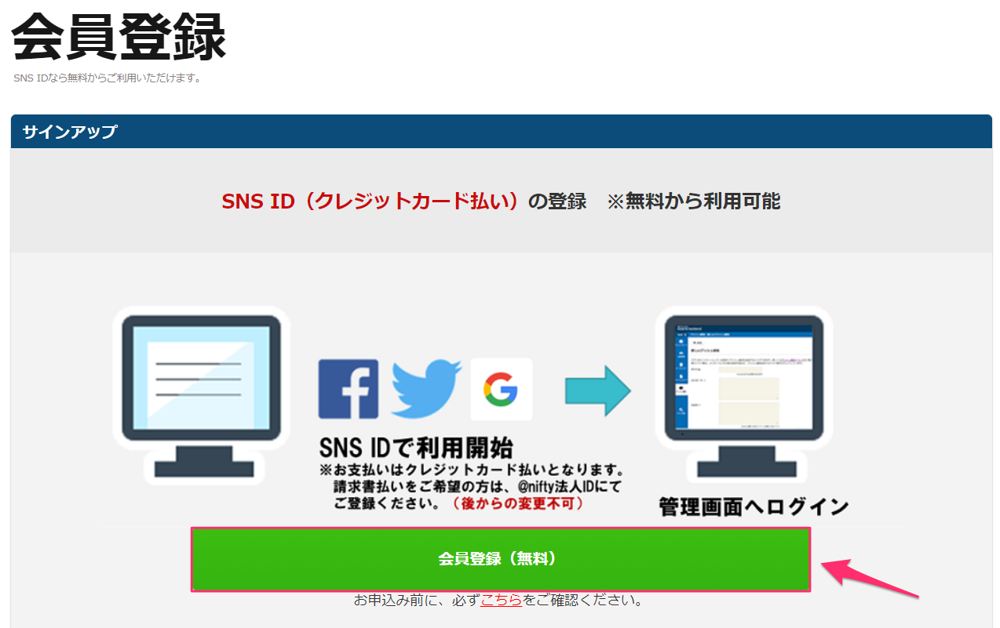]

---
.bottom-bar[
  6.&nbsp;TRY：コメント入力機能をつけよう
]

### 6.2. ニフクラ mobile backend の準備

「Google で登録する」をクリックします。

.center[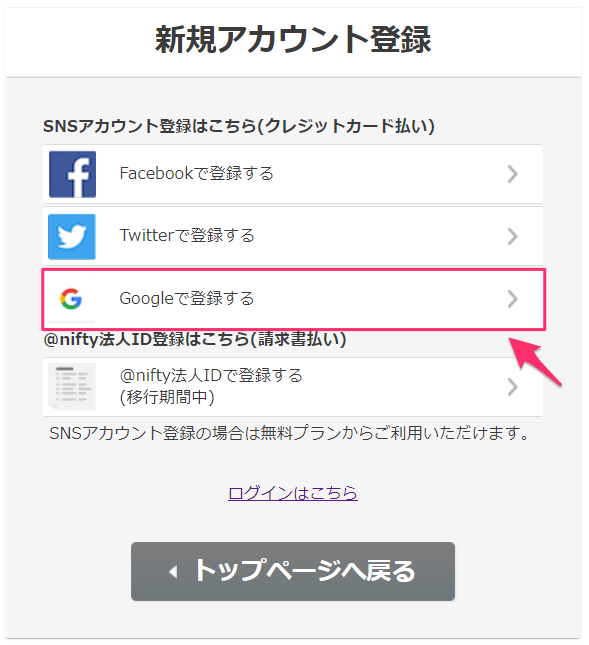]

---
.bottom-bar[
  6.&nbsp;TRY：コメント入力機能をつけよう
]

### 6.2. ニフクラ mobile backend の準備

自分の Gmail をクリックします。

.center[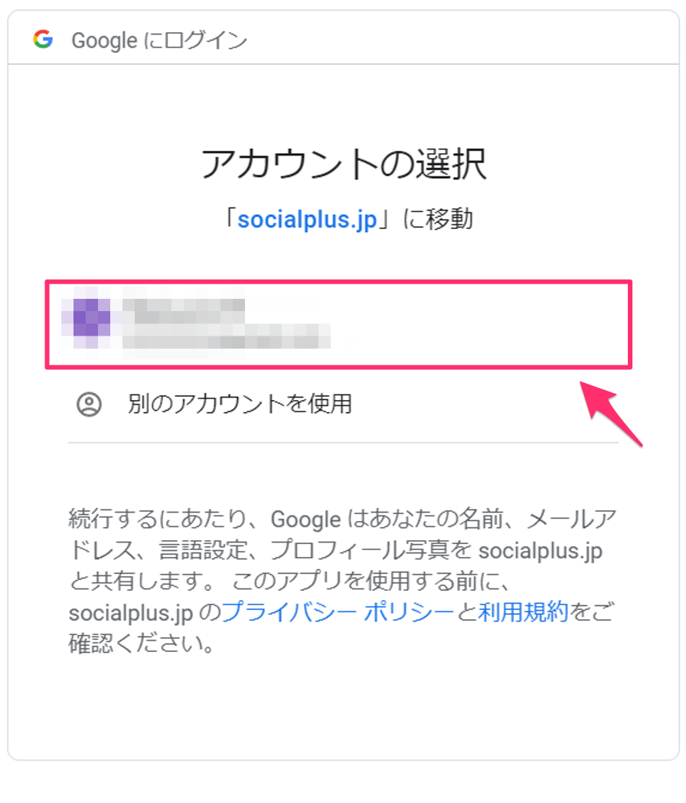]

---
.bottom-bar[
  6.&nbsp;TRY：コメント入力機能をつけよう
]

### 6.2. ニフクラ mobile backend の準備

「メールアドレス」はそのままでOKです。「確認メールを送信」をクリックします。

.center[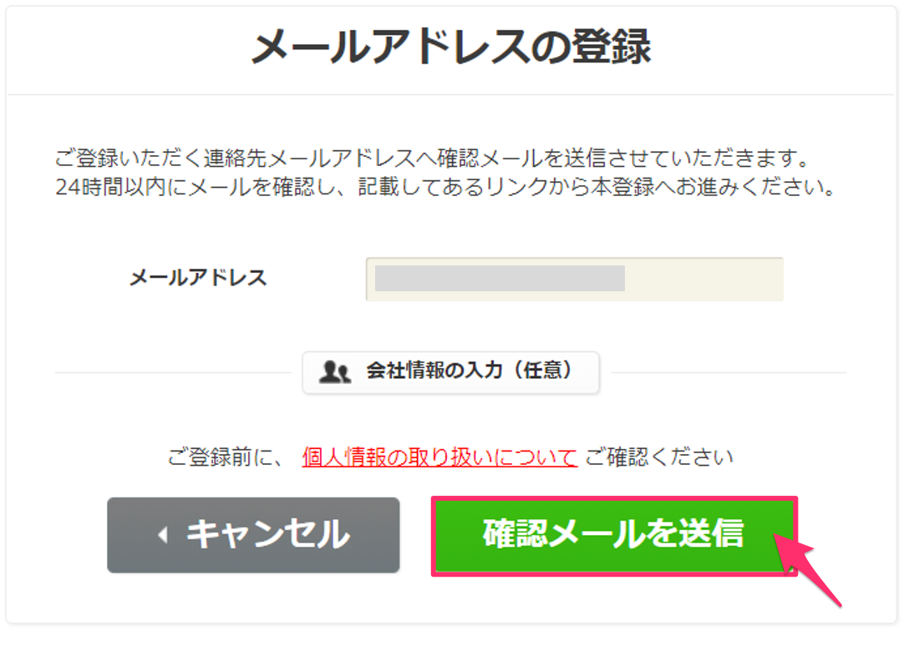]

---
.bottom-bar[
  6.&nbsp;TRY：コメント入力機能をつけよう
]

### 6.2. ニフクラ mobile backend の準備

確認メールが送られます。先ほど開いておいたGmailのタブを開きましょう。

.center[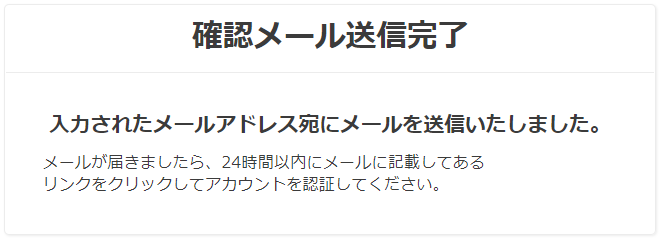]

---
.bottom-bar[
  6.&nbsp;TRY：コメント入力機能をつけよう
]

### 6.2. ニフクラ mobile backend の準備

メールに書かれている「URL」をクリックします。

.center[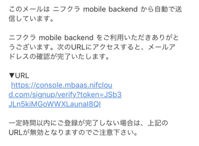]

---
.bottom-bar[
  6.&nbsp;TRY：コメント入力機能をつけよう
]

### 6.2. ニフクラ mobile backend の準備

「以上の規約に同意する」にチェックを入れて「アカウント登録」をクリックします。

.center[]

---
.bottom-bar[
  6.&nbsp;TRY：コメント入力機能をつけよう
]

### 6.2. ニフクラ mobile backend の準備

アカウントが作成され、ニフクラ mobile backend にログインできました🎉

.center[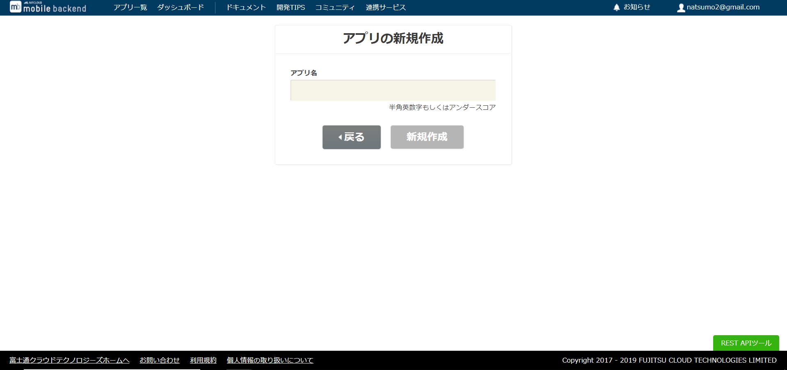]

.size_small_7[
.right[
（参考）お家で mobile backend を使うときは、https://mbaas.nifcloud.com/ からログインして使いましょう☝️
]
]

---
.bottom-bar[
  6.&nbsp;TRY：コメント入力機能をつけよう
]

### 6.2. ニフクラ mobile backend の準備

ニフクラ mobile backend 上に.color_pink[__メッセージを保存するための場所__]を用意しましょう。<br>
クラウドの中にも.color_pink[__アプリ__]を作ります。<br>
「ProfileApp」と入力して「新規作成」をクリックします。

.center[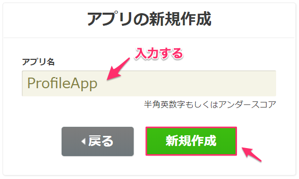]


---
.bottom-bar[
  6.&nbsp;TRY：コメント入力機能をつけよう
]

### 6.2. ニフクラ mobile backend の準備

クラウドにアプリが作成されました🎉<br>
アプリが作成されると.color_pink[__APIキー__]という２種類の鍵が発行されます。

.center[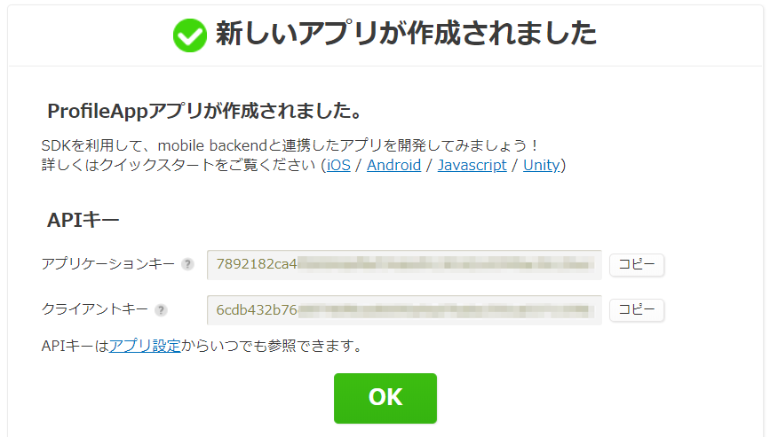]

APIキーは後ほど使います。一旦このままにしておきましょう。

---
.bottom-bar[
  6.&nbsp;TRY：コメント入力機能をつけよう
]

### 6.2. ニフクラ mobile backend の準備

.col-6[
もう一度Monacaの開発画面のタブに戻りましょう。<br>
クラウドの準備ができたので、<br>Monacaでクラウドを使う準備をしていきます。<br>
<br>
「設定」をクリックして、その中にある「JS/CSSコンポーネントの追加と削除」をクリックします。
]
.col-6[
.center[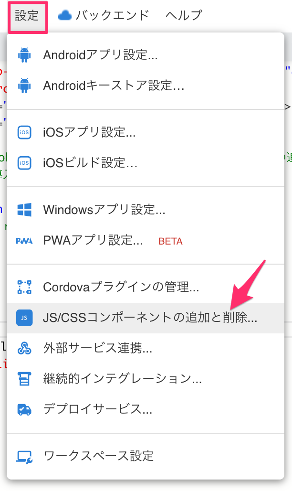]
]

---
.bottom-bar[
  6.&nbsp;TRY：コメント入力機能をつけよう
]

### 6.2. ニフクラ mobile backend の準備

「コンポーネント名」のところに「_NCMB_」と入力して、隣にある「検索する」をクリックします。

.center[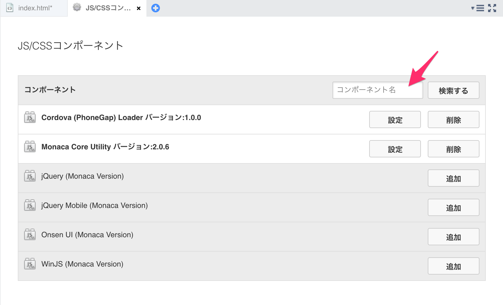]

---
.bottom-bar[
  6.&nbsp;TRY：コメント入力機能をつけよう
]

### 6.2. ニフクラ mobile backend の準備

「ncmb」が表示されるので「追加」をクリックします。

.center[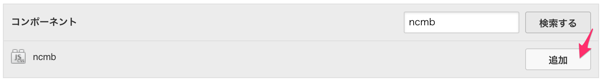]

<br><br><br><br><br>
.size_small_7[
（参考）ニフクラmobile backend を Monaca で使う場合は、この「ncmb」を必ず追加する必要があるよ！
>JavaScript SDK

]

---
.bottom-bar[
  6.&nbsp;TRY：コメント入力機能をつけよう
]

### 6.2. ニフクラ mobile backend の準備

「インストール」をクリックします。

.center[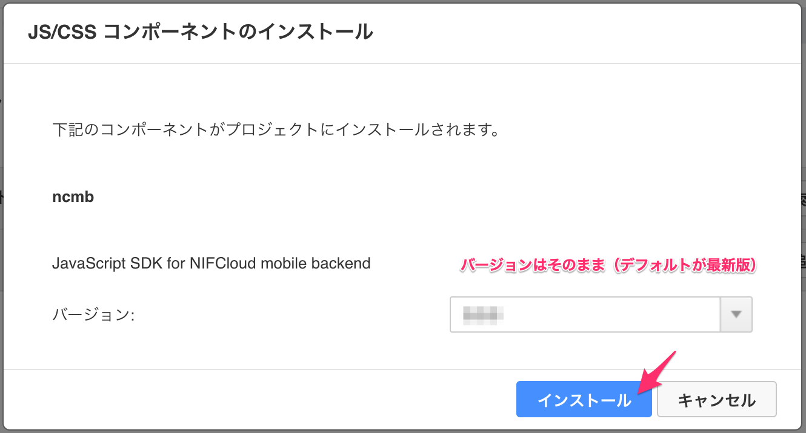]

---
.bottom-bar[
  6.&nbsp;TRY：コメント入力機能をつけよう
]

### 6.2. ニフクラ mobile backend の準備

必ずチェックを入れてから「OK」をクリックします。

.center[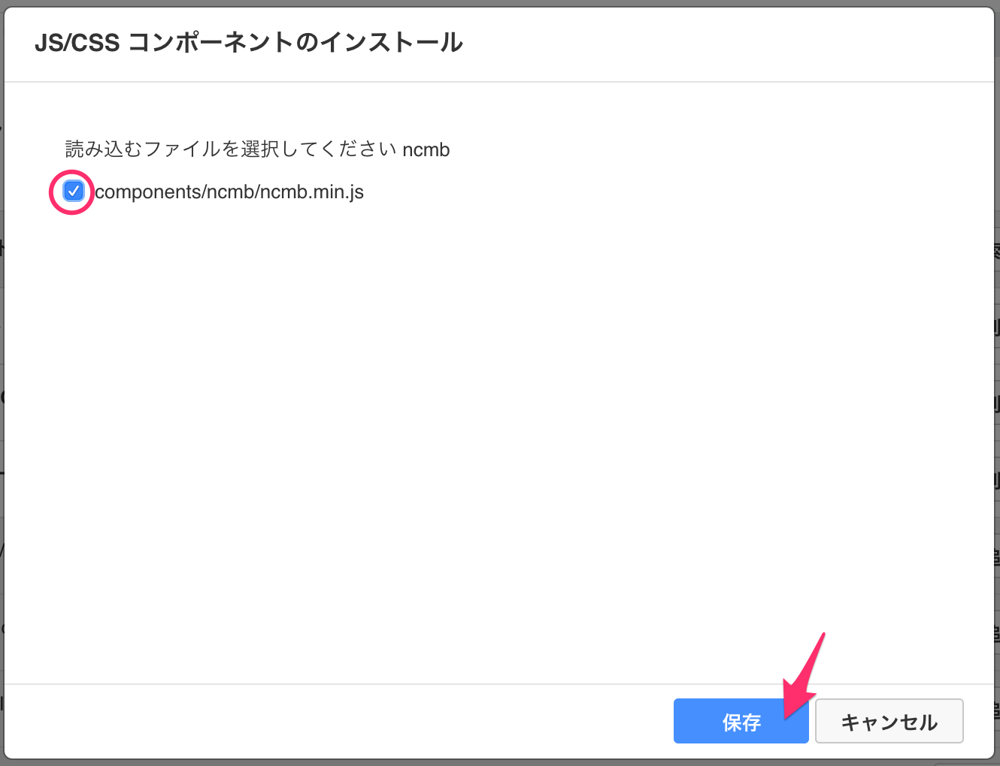]

---
.bottom-bar[
  6.&nbsp;TRY：コメント入力機能をつけよう
]

### 6.2. ニフクラ mobile backend の準備

最初の一覧に戻ります。<br>
一覧に「ncmb」が追加されていればOKです。

.center[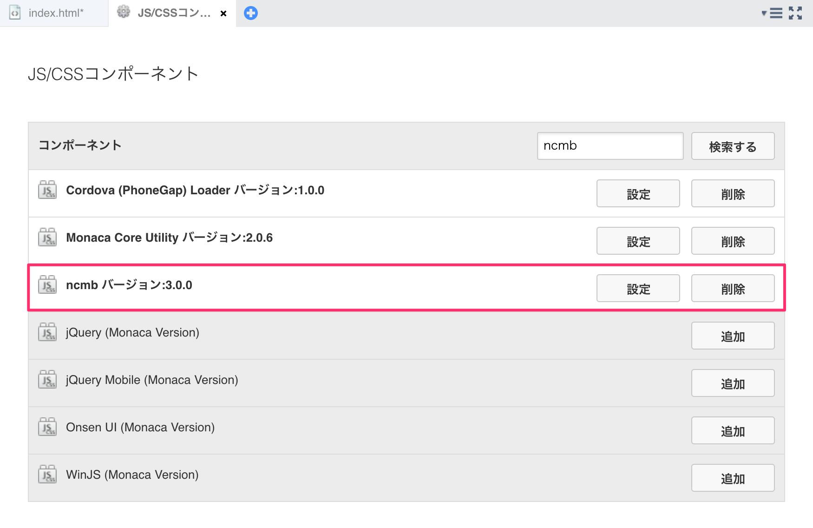]

---
.bottom-bar[
  6.&nbsp;TRY：コメント入力機能をつけよう
]

### 6.2. ニフクラ mobile backend の準備

この画面を閉じて、index.html を表示しましょう。

.center[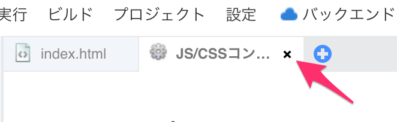]

---
.bottom-bar[
  6.&nbsp;TRY：コメント入力機能をつけよう
]

### 6.2. ニフクラ mobile backend の準備
#### コピペするためにこの資料をパソコンにダウンロードする

さて、この後から自分で書くのではなく、出来上がったコードをコピペで使っていくために、コピー元のデータを用意しましょう。<br>
ブラウザの別のタブを開いて、次のリンクを入力してEnterキーを押します。

.center[
.size_large_18[
http://bit.ly/MonacaEasyStartApp
]
]

---
.bottom-bar[
  6.&nbsp;TRY：コメント入力機能をつけよう
]

### 6.2. ニフクラ mobile backend の準備
#### コピペするためにこの資料をパソコンにダウンロードする

資料がダウンロードされます。<br>
画面左下にファイルがダウンロードされるのでクリックして開きましょう。

.center[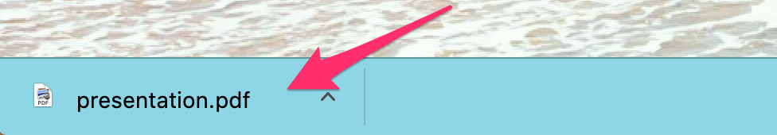]

---
.bottom-bar[
  6.&nbsp;TRY：コメント入力機能をつけよう
]

### 6.2. ニフクラ mobile backend の準備
#### コピペするためにこの資料をパソコンにダウンロードする

別のタブが開いて、資料が表示されます。

.center[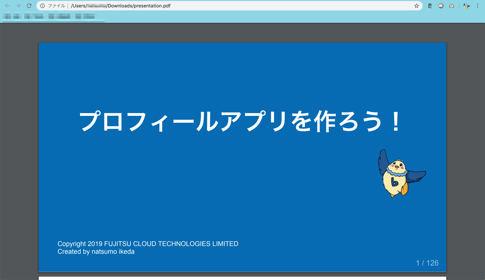]


---
.bottom-bar[
  6.&nbsp;TRY：コメント入力機能をつけよう
]

### 6.2. ニフクラ mobile backend の準備

Monacaの開発画面のタブに戻って、index.html を編集します。<br>
index.html に元々ある.color_pink[__scriptタグ__]（ `<script>`, `</script>` ）内に次の内容をコピペします。<br>
まずは先ほどダウンロードした資料のタブを開いて、次のコードをマウスで選択し、__右クリック__ して「コピー」をクリックします。

```js
// ニフクラ mobile backend を使うための準備
var applicationKey = "YOUR_APPLICATION_KEY";
var clientKey = "YOUR_CLIENT_KEY";
var ncmb = new NCMB(applicationKey, clientKey);
```
<br><br>
>SDKの初期化

---
.bottom-bar[
  6.&nbsp;TRY：コメント入力機能をつけよう
]

### 6.2. ニフクラ mobile backend の準備

次にMonacaの開発画面のタブに戻って、scriptタグ の間で右クリックをして「ペースト」をクリックします。<br>
次のように表示されればOKです。

.center[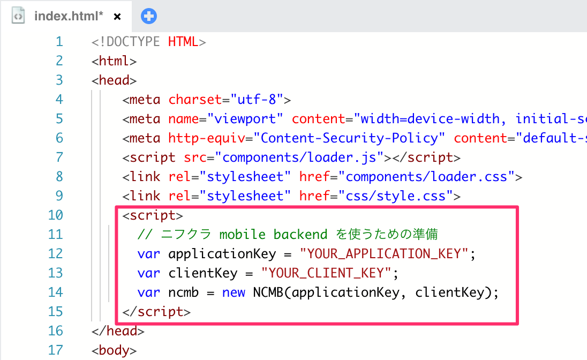]

---
.bottom-bar[
  6.&nbsp;TRY：コメント入力機能をつけよう
]

### 6.2. ニフクラ mobile backend の準備

`YOUR_APPLICATION_KEY`, `YOUR_CLIENT_KEY`の部分を書き換えます。

.center[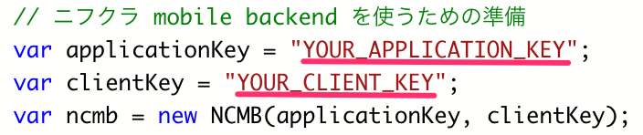]
---
.bottom-bar[
  6.&nbsp;TRY：コメント入力機能をつけよう
]

### 6.2. ニフクラ mobile backend の準備

先ほど準備した ニフクラ mobile backend のタブを開きましょう。<br>
アプリケーションキーの「コピー」ボタンをクリックします。

.center[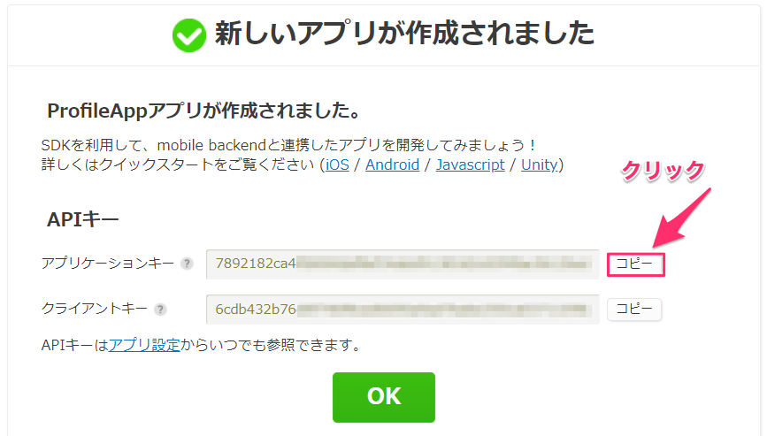]

---
.bottom-bar[
  6.&nbsp;TRY：コメント入力機能をつけよう
]

### 6.2. ニフクラ mobile backend の準備

Monacaの開発画面のタブに戻ります。<br>
`YOUR_APPLICATION_KEY` をダブルクリックすると文字が青くなります。その状態で右クリックをして「貼り付け」をクリックします。

.center[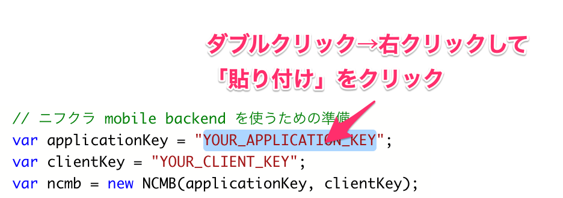]

---
.bottom-bar[
  6.&nbsp;TRY：コメント入力機能をつけよう
]

### 6.2. ニフクラ mobile backend の準備

こんな感じで書き変わればOKです！続いてもう一度同じように `YOUR_CLIENT_KEY` も書き変えます。

.center[]
---
.bottom-bar[
  6.&nbsp;TRY：コメント入力機能をつけよう
]

### 6.2. ニフクラ mobile backend の準備

再び ニフクラ mobile backend のタブを開きましょう。<br>
今度は２つ目のクライアントキーの「コピー」ボタンをクリックします。

.center[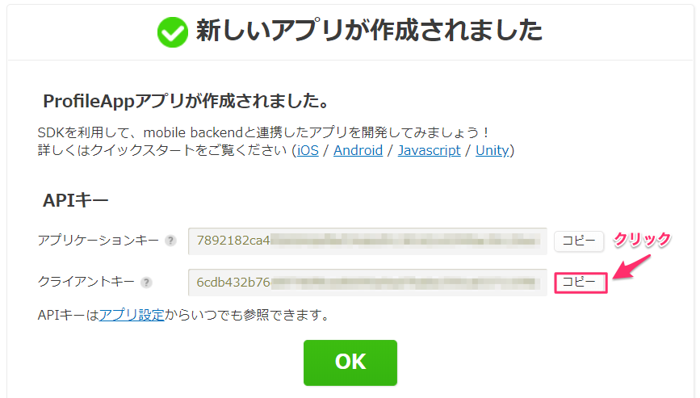]

---
.bottom-bar[
  6.&nbsp;TRY：コメント入力機能をつけよう
]

### 6.2. ニフクラ mobile backend の準備

Monacaの開発画面のタブに戻ります。<br>
先ほどと同様に、`YOUR_CLIENT_KEY` をダブルクリックすると文字が青くなります。その状態で右クリックをして「貼り付け」をクリックします。

.center[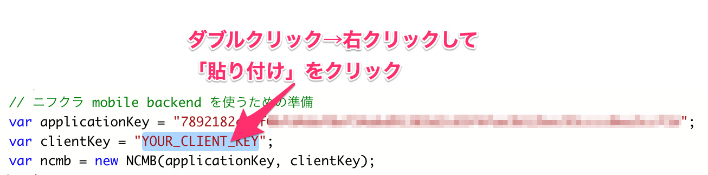]

---
.bottom-bar[
  6.&nbsp;TRY：コメント入力機能をつけよう
]

### 6.2. ニフクラ mobile backend の準備

これでクラウドの準備は完了です🎉

.center[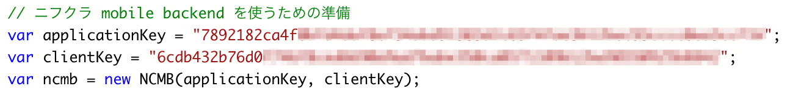]
---
.bottom-bar[
  6.&nbsp;TRY：コメント入力機能をつけよう
]

### 6.3. コピペで機能追加

コメント入力機能を追加していきましょう。<br>
index.html の bodyタグ の一番下に、次の内容をコピペします。<br>

```HTML
<form name="messageForm">
  <input type="text" name="message" size="30" maxlength="20">
  <input type="button" value="送信" onclick="sendMessage();">
</form>
<div id="log"></div>
```

* ダウンロードした資料のタブを開いて、次のコードをコピーする
* Monaca開発画面に戻って index.html の bodyタグ の一番下にペーストする

---
.bottom-bar[
  6.&nbsp;TRY：コメント入力機能をつけよう
]

### 6.3. コピペで機能追加

こんな感じになればOKです！

.center[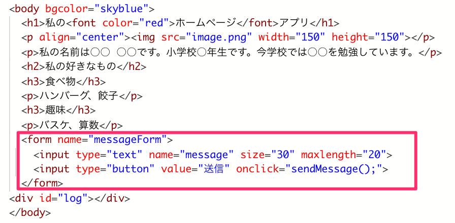]

これで画面にコメント入力欄が追加されますが、まだボタンを押した後の処理をコーディングしていないので、ボタンを押しても何も動きません。

---
.bottom-bar[
  6.&nbsp;TRY：コメント入力機能をつけよう
]

### 6.3. コピペで機能追加

送信ボタンを押すとメッセージが保存されていくように処理を書いていきましょう<br>
先ほど書いた内容に続けて、scriptタグ 内に次の内容をコピペします。（さっきと同じようにやろう！）

.size_small_5[
```js
function sendMessage() {
  var text = document.forms.messageForm.message.value;
  if(text.length === 0) {
    document.getElementById("log").innerText = "NG";
    return false;
  }
  var MessageClass = ncmb.DataStore("MessageClass");
  var messageClass = new MessageClass();
  messageClass.set("message", text)
          .save()
          .then(function(){
            document.getElementById("log").innerText = "OK"
          })
          .catch(function(err){
            document.getElementById("log").innerText = "Error:" + err.code;
          });
}
```
]

---
.bottom-bar[
  6.&nbsp;TRY：コメント入力機能をつけよう
]

### 6.3. コピペで機能追加

こんな感じになればOKです！

.center[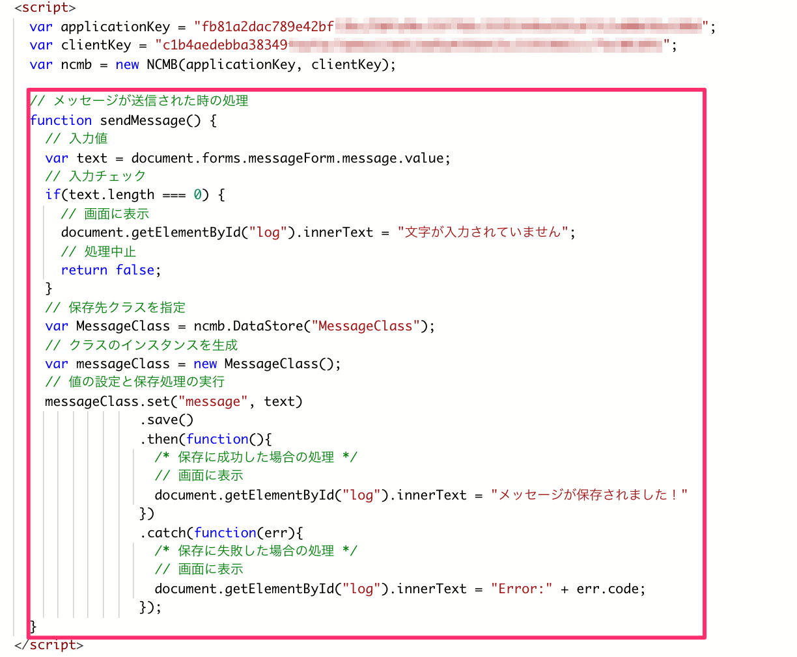]

これで全て作業は完了です🎉🎉🎉正しく動くか動作を確認しましょう！

---
.bottom-bar[
  6.&nbsp;TRY：コメント入力機能をつけよう
]

### 6.4. 動作確認

.col-6[
プレビュー画面で確認しましょう。<br>テストメッセージ（なんでもOK）を入力してみましょう。
]
.col-6[
.center[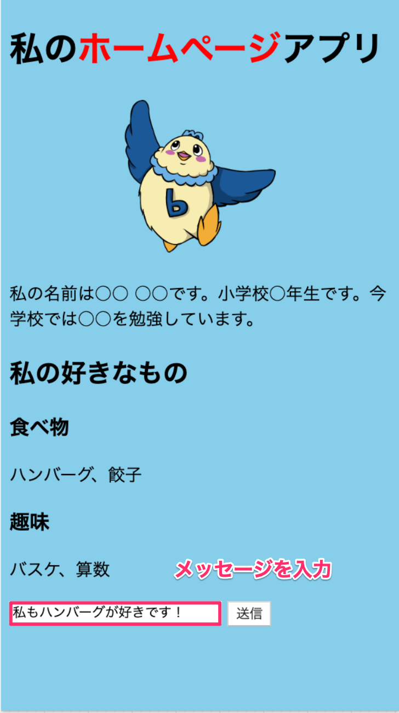]
]

---
.bottom-bar[
  6.&nbsp;TRY：コメント入力機能をつけよう
]

### 6.4. 動作確認

.col-6[
「送信」ボタンを押してみましょう。<br>
結果として下に「OK」と出ればOKです！
]
.col-6[
.center[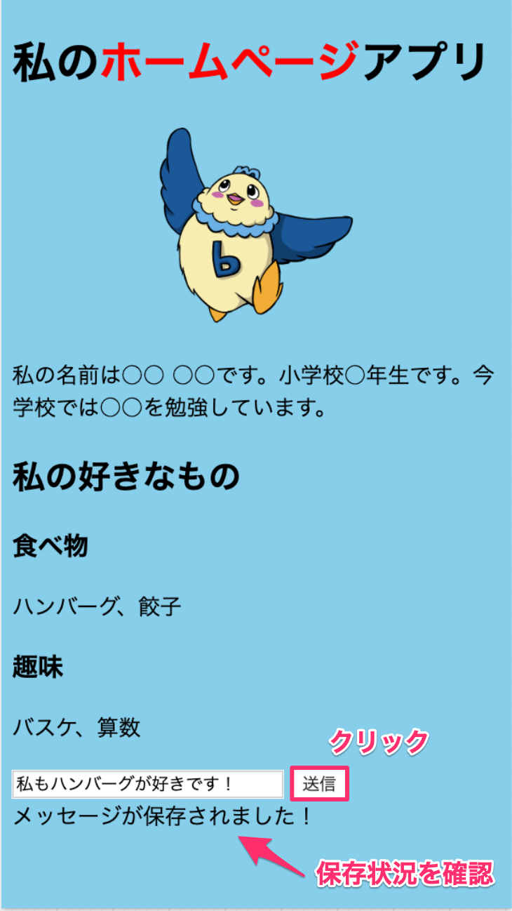]
]

---
.bottom-bar[
  6.&nbsp;TRY：コメント入力機能をつけよう
]

### 6.4. 動作確認

クラウド側も確認してみましょう。ニフクラ mobile backend のタグを開きます。<br>
APIキー画面が表示されているので、「OK」をクリックして閉じましょう。

.center[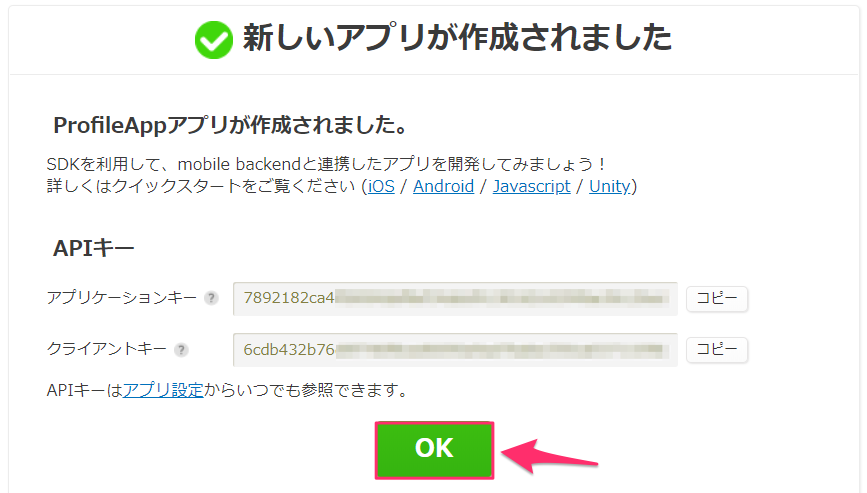]

---
.bottom-bar[
  6.&nbsp;TRY：コメント入力機能をつけよう
]

### 6.4. 動作確認

ダッシュボードが表示されるので、左側の「データストア」をクリックします。<br>
「MessageClass」をクリックすると、入力したデータが保存されていることを確認できます。

.center[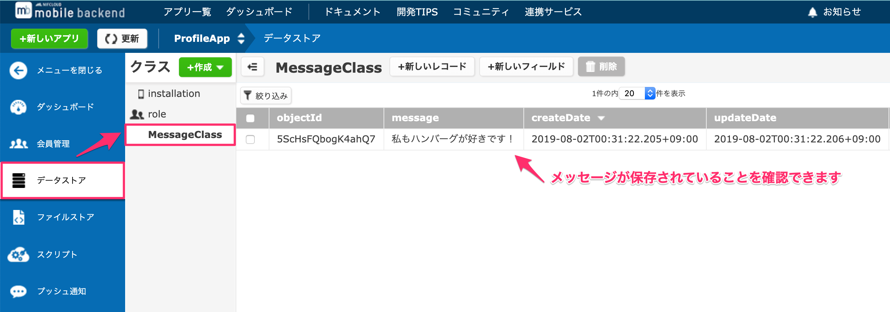]


---
layout: true
class: center, middle, animation-fade
---
# 7. アプリを使って自己紹介しよう！

---
layout: false

.bottom-bar[
  7.&nbsp;アプリを使って自己紹介しよう！
]

.col-7[
作ったプロフィールアプリを使って、<br>自己紹介をしましょう😄

* みんなのパソコンのプレビュー画面をのぞきにいきましょう！
* コメントを残してあげましょう！
* せっかく作ったアプリなので、勝手に書き変えたりはしないでね！
* 終わったらクラウドに保存されたメッセージを確認しましょう！
]
.col-5[
.center[]
]

---
layout: true
class: center, middle, animation-fade
---
# まとめ

---
layout: false

.bottom-bar[
  まとめ
]

# まとめ
## 今日できたこと！

* Monacaを使ってアプリを作った！
  * HTMLの書き方を学習
* ニフクラ mobile backend を使ってクラウドを使ってみた！
  * クラウドにデータが保存できることを学習

---
.bottom-bar[
  まとめ
]

# まとめ
.col-7[
## 参考書の紹介

参考書「 .font_color_ncmb_blue[**Monaca と ニフクラ mobile backend で学ぶ はじめてのプログラミング ～クラウド連携アプリ開発編～**] 」は今回少しだけ使ってみた<br>.color_pink[__クラウド__]の詳しい使い方がのっている学習参考書です。ぜひお家に帰ってから参考書で勉強してみてくださいね👍

参考書ご紹介ページ
https://mbaas.nifcloud.com/education/index.html
]
.col-5[
.center[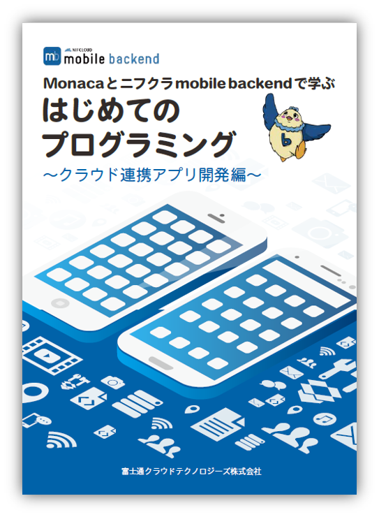]
]
